# Design Document: CloudFront Function Associations

## Overview

This design adds 8 optional CloudFormation parameters to the network template (`template-network-route53-cloudfront-s3-apigw.yml`) that allow users to associate existing CloudFront Functions with cache behaviors. Four parameters target static content behaviors (viewer-request, viewer-response, origin-request, origin-response) and four target API origin behaviors. Each parameter accepts a CloudFront Function ARN or an empty string (default). When provided, the ARN is conditionally included in the `FunctionAssociations` list of the appropriate cache behavior using `!If` / `AWS::NoValue` patterns.

No new resources are created. The changes are limited to:
- 8 new parameters with ARN validation
- 2 new Metadata parameter groups
- 8 new conditions (one per parameter)
- Modifications to 3 existing cache behaviors (DefaultCacheBehavior, static path behavior, API path behavior)

The template version (v0.0.16, PATCH=0) is in development mode, so no version increment is required.

## Architecture

The feature integrates into the existing CloudFront distribution resource. The architecture is purely declarative CloudFormation configuration — no runtime components are added.

```mermaid
graph TD
    subgraph Parameters
        SVR[CloudFrontStaticFunctionViewerRequest]
        SVS[CloudFrontStaticFunctionViewerResponse]
        SOR[CloudFrontStaticFunctionOriginRequest]
        SORS[CloudFrontStaticFunctionOriginResponse]
        AVR[CloudFrontApiFunctionViewerRequest]
        AVS[CloudFrontApiFunctionViewerResponse]
        AOR[CloudFrontApiFunctionOriginRequest]
        AORS[CloudFrontApiFunctionOriginResponse]
    end

    subgraph Conditions
        HSVR[HasStaticFunctionViewerRequest]
        HSVS[HasStaticFunctionViewerResponse]
        HSOR[HasStaticFunctionOriginRequest]
        HSORS[HasStaticFunctionOriginResponse]
        HAVR[HasApiFunctionViewerRequest]
        HAVS[HasApiFunctionViewerResponse]
        HAOR[HasApiFunctionOriginRequest]
        HAORS[HasApiFunctionOriginResponse]
    end

    SVR --> HSVR
    SVS --> HSVS
    SOR --> HSOR
    SORS --> HSORS
    AVR --> HAVR
    AVS --> HAVS
    AOR --> HAOR
    AORS --> HAORS

    subgraph CacheBehaviors["Cache Behaviors (existing)"]
        DCB[DefaultCacheBehavior]
        SPB[Static Path Behavior]
        APB[API Path Behavior]
    end

    HSVR --> DCB
    HSVS --> DCB
    HSOR --> DCB
    HSORS --> DCB
    HSVR --> SPB
    HSVS --> SPB
    HSOR --> SPB
    HSORS --> SPB
    HAVR --> DCB
    HAVS --> DCB
    HAOR --> DCB
    HAORS --> DCB
    HAVR --> APB
    HAVS --> APB
    HAOR --> APB
    HAORS --> APB
```



The DefaultCacheBehavior receives either static or API function associations depending on the `StaticOriginIsRoot` condition. The path-based behaviors always receive their respective origin type's function associations.

## Components and Interfaces

### 1. Parameters (8 new)

All 8 parameters follow an identical structure, differing only in name and description. They are organized into two groups: Static and API.

**Parameter definition pattern:**

```yaml
CloudFront{Static|Api}Function{EventType}:
  Type: String
  Description: "CloudFront Function ARN for {event-type} event on {static|API} behaviors. Leave empty to not associate a function."
  Default: ""
  AllowedPattern: "^arn:aws:cloudfront::[0-9]{12}:function\\/[a-zA-Z0-9-_]{1,64}$|^$"
  ConstraintDescription: "Must be a valid CloudFront Function ARN (arn:aws:cloudfront::<account-id>:function/<function-name>) or empty."
```

**Static parameters:**
| Parameter Name | Event Type |
|---|---|
| `CloudFrontStaticFunctionViewerRequest` | viewer-request |
| `CloudFrontStaticFunctionViewerResponse` | viewer-response |
| `CloudFrontStaticFunctionOriginRequest` | origin-request |
| `CloudFrontStaticFunctionOriginResponse` | origin-response |

**API parameters:**
| Parameter Name | Event Type |
|---|---|
| `CloudFrontApiFunctionViewerRequest` | viewer-request |
| `CloudFrontApiFunctionViewerResponse` | viewer-response |
| `CloudFrontApiFunctionOriginRequest` | origin-request |
| `CloudFrontApiFunctionOriginResponse` | origin-response |

### 2. Metadata Parameter Groups (2 new)

Two new parameter groups are added to `AWS::CloudFormation::Interface`, placed after the existing "Cache Policies" group:

1. **"Static CloudFront Function Associations"** — contains the 4 static parameters
2. **"API CloudFront Function Associations"** — contains the 4 API parameters

### 3. Conditions (8 new)

Each parameter gets a corresponding condition that evaluates to `true` when the parameter is not empty:

```yaml
HasStaticFunctionViewerRequest: !Not [!Equals [!Ref CloudFrontStaticFunctionViewerRequest, '']]
HasStaticFunctionViewerResponse: !Not [!Equals [!Ref CloudFrontStaticFunctionViewerResponse, '']]
HasStaticFunctionOriginRequest: !Not [!Equals [!Ref CloudFrontStaticFunctionOriginRequest, '']]
HasStaticFunctionOriginResponse: !Not [!Equals [!Ref CloudFrontStaticFunctionOriginResponse, '']]
HasApiFunctionViewerRequest: !Not [!Equals [!Ref CloudFrontApiFunctionViewerRequest, '']]
HasApiFunctionViewerResponse: !Not [!Equals [!Ref CloudFrontApiFunctionViewerResponse, '']]
HasApiFunctionOriginRequest: !Not [!Equals [!Ref CloudFrontApiFunctionOriginRequest, '']]
HasApiFunctionOriginResponse: !Not [!Equals [!Ref CloudFrontApiFunctionOriginResponse, '']]
```

### 4. Cache Behavior Modifications

Each cache behavior that can have function associations gets a `FunctionAssociations` list. Each item in the list is conditionally included using `!If` with `AWS::NoValue`:

```yaml
FunctionAssociations:
  - !If
    - HasStaticFunctionViewerRequest
    - EventType: viewer-request
      FunctionARN: !Ref CloudFrontStaticFunctionViewerRequest
    - !Ref AWS::NoValue
  - !If
    - HasStaticFunctionViewerResponse
    - EventType: viewer-response
      FunctionARN: !Ref CloudFrontStaticFunctionViewerResponse
    - !Ref AWS::NoValue
  - !If
    - HasStaticFunctionOriginRequest
    - EventType: origin-request
      FunctionARN: !Ref CloudFrontStaticFunctionOriginRequest
    - !Ref AWS::NoValue
  - !If
    - HasStaticFunctionOriginResponse
    - EventType: origin-response
      FunctionARN: !Ref CloudFrontStaticFunctionOriginResponse
    - !Ref AWS::NoValue
```

**Behavior-to-parameter mapping:**

| Cache Behavior | When Active | Function Parameters |
|---|---|---|
| DefaultCacheBehavior (static root) | `StaticOriginIsRoot` = true | Static function params |
| DefaultCacheBehavior (API root) | `StaticOriginIsRoot` = false | API function params |
| Static path behavior | `HasRouteForStaticOrigin` = true | Static function params |
| API path behavior | `HasRouteForApiInCloudFront` = true | API function params |

**DefaultCacheBehavior** is the most complex because it serves either static or API content depending on `StaticOriginIsRoot`. The `FunctionAssociations` must use a top-level `!If` to select the correct set:

```yaml
FunctionAssociations:
  !If
    - StaticOriginIsRoot
    # Static function associations
    - - !If
        - HasStaticFunctionViewerRequest
        - EventType: viewer-request
          FunctionARN: !Ref CloudFrontStaticFunctionViewerRequest
        - !Ref AWS::NoValue
      - !If
        - HasStaticFunctionViewerResponse
        - EventType: viewer-response
          FunctionARN: !Ref CloudFrontStaticFunctionViewerResponse
        - !Ref AWS::NoValue
      - !If
        - HasStaticFunctionOriginRequest
        - EventType: origin-request
          FunctionARN: !Ref CloudFrontStaticFunctionOriginRequest
        - !Ref AWS::NoValue
      - !If
        - HasStaticFunctionOriginResponse
        - EventType: origin-response
          FunctionARN: !Ref CloudFrontStaticFunctionOriginResponse
        - !Ref AWS::NoValue
    # API function associations
    - - !If
        - HasApiFunctionViewerRequest
        - EventType: viewer-request
          FunctionARN: !Ref CloudFrontApiFunctionViewerRequest
        - !Ref AWS::NoValue
      - !If
        - HasApiFunctionViewerResponse
        - EventType: viewer-response
          FunctionARN: !Ref CloudFrontApiFunctionViewerResponse
        - !Ref AWS::NoValue
      - !If
        - HasApiFunctionOriginRequest
        - EventType: origin-request
          FunctionARN: !Ref CloudFrontApiFunctionOriginRequest
        - !Ref AWS::NoValue
      - !If
        - HasApiFunctionOriginResponse
        - EventType: origin-response
          FunctionARN: !Ref CloudFrontApiFunctionOriginResponse
        - !Ref AWS::NoValue
```

### Design Decision: FunctionAssociations list always present

CloudFormation allows a `FunctionAssociations` list where all items resolve to `AWS::NoValue` — the list effectively becomes empty and CloudFront treats it as if no function associations exist. This means we can always include the `FunctionAssociations` property on each behavior without needing an additional top-level condition to wrap the entire property. This simplifies the template and maintains backward compatibility: when all parameters are empty, all items resolve to `AWS::NoValue`, producing the same behavior as the current template.

## Data Models

### CloudFront Function ARN Format

```
arn:aws:cloudfront::<account-id>:function/<function-name>
```

- `<account-id>`: 12-digit AWS account ID
- `<function-name>`: 1-64 characters, alphanumeric, hyphens, and underscores

**Validation regex:** `^arn:aws:cloudfront::[0-9]{12}:function\\/[a-zA-Z0-9-_]{1,64}$|^$`

The `|^$` suffix allows empty strings (parameter not provided).

### CloudFormation FunctionAssociation Object

```yaml
EventType: viewer-request | viewer-response | origin-request | origin-response
FunctionARN: <CloudFront Function ARN>
```

### Parameter-to-Condition-to-EventType Mapping

| Parameter | Condition | EventType |
|---|---|---|
| CloudFrontStaticFunctionViewerRequest | HasStaticFunctionViewerRequest | viewer-request |
| CloudFrontStaticFunctionViewerResponse | HasStaticFunctionViewerResponse | viewer-response |
| CloudFrontStaticFunctionOriginRequest | HasStaticFunctionOriginRequest | origin-request |
| CloudFrontStaticFunctionOriginResponse | HasStaticFunctionOriginResponse | origin-response |
| CloudFrontApiFunctionViewerRequest | HasApiFunctionViewerRequest | viewer-request |
| CloudFrontApiFunctionViewerResponse | HasApiFunctionViewerResponse | viewer-response |
| CloudFrontApiFunctionOriginRequest | HasApiFunctionOriginRequest | origin-request |
| CloudFrontApiFunctionOriginResponse | HasApiFunctionOriginResponse | origin-response |


## Correctness Properties

*A property is a characteristic or behavior that should hold true across all valid executions of a system — essentially, a formal statement about what the system should do. Properties serve as the bridge between human-readable specifications and machine-verifiable correctness guarantees.*

### Property 1: All function parameters default to empty string

*For any* CloudFront Function parameter (all 8: static and API, across all 4 event types), the `Default` value must be an empty string `""`.

**Validates: Requirements 1.5, 2.5, 10.1, 10.3**

### Property 2: ARN validation regex accepts valid CloudFront Function ARNs and rejects invalid strings

*For any* string, the `AllowedPattern` regex on each of the 8 CloudFront Function parameters must accept the string if and only if it is either empty or matches the CloudFront Function ARN format `arn:aws:cloudfront::<12-digit-account>:function/<valid-name>`.

**Validates: Requirements 1.6, 2.6**

### Property 3: Each function parameter has a corresponding not-empty condition

*For any* of the 8 CloudFront Function parameters, there exists a corresponding condition in the template that evaluates to true when the parameter value is not an empty string, using the `!Not [!Equals [!Ref <param>, '']]` pattern.

**Validates: Requirements 4.1, 4.2**

### Property 4: Function association items use conditional inclusion via AWS::NoValue

*For any* function association entry in any cache behavior's `FunctionAssociations` list, the entry must use an `!If` construct that resolves to the `FunctionAssociation` object (with correct `EventType` and `FunctionARN`) when the corresponding condition is true, and resolves to `AWS::NoValue` when false.

**Validates: Requirements 4.3, 4.4**

## Error Handling

This feature is purely declarative CloudFormation configuration. Error handling is provided by CloudFormation's built-in mechanisms:

1. **Invalid ARN format**: CloudFormation rejects the stack create/update at parameter validation time if the provided value doesn't match the `AllowedPattern` regex. The `ConstraintDescription` provides a human-readable error message.

2. **Non-existent function ARN**: CloudFormation/CloudFront will return an error during stack create/update if the ARN points to a function that doesn't exist. This is handled by AWS service-level validation, not the template.

3. **Empty parameters (default)**: All parameters default to empty string. The `!If` / `AWS::NoValue` pattern ensures no function association is created, preserving current behavior.

4. **Incompatible function associations**: CloudFront enforces its own limits (e.g., only one function per event type per behavior). If a user provides conflicting configurations, CloudFront returns an error during deployment. The template does not need to validate this — it's a service-level constraint.

## Testing Strategy

### Testing Framework

- **Language**: Python
- **Unit testing**: pytest
- **Property-based testing**: hypothesis (already in use in the project)
- **Test utilities**: Existing `tests/cfn_test_utils.py` (provides `load_template`, `get_template_section`, `validate_regex_pattern`, etc.)

### Unit Tests (Primary)

Unit tests verify the template structure with concrete assertions. These are the primary testing mechanism per project steering guidelines.

**Test file**: `tests/test_network_template_unit.py` (extend existing file)

Tests to implement:

1. **Parameter existence**: All 8 CloudFront Function parameters exist in the template
2. **Parameter type**: All 8 parameters are of type `String`
3. **Parameter defaults**: All 8 parameters default to `""` (covers Property 1)
4. **Parameter AllowedPattern**: All 8 parameters have the correct ARN validation regex
5. **Parameter ConstraintDescription**: All 8 parameters have a non-empty ConstraintDescription
6. **Metadata groups**: "Static CloudFront Function Associations" and "API CloudFront Function Associations" groups exist with correct parameters in correct order
7. **Metadata group ordering**: Static group appears after Cache Policies, API group appears after Static group
8. **Condition existence**: All 8 Has* conditions exist
9. **Condition structure**: Each condition uses `!Not [!Equals [..., '']]` pattern (covers Property 3)
10. **DefaultCacheBehavior FunctionAssociations**: Verify the `!If StaticOriginIsRoot` branching with correct static/API function associations
11. **Static path behavior FunctionAssociations**: Verify static function associations are present
12. **API path behavior FunctionAssociations**: Verify API function associations are present
13. **Isolation — static path behavior**: No API function references in static path behavior
14. **Isolation — API path behavior**: No static function references in API path behavior
15. **Backward compatibility**: Template version remains v0.0.16
16. **ARN regex validation**: Test specific valid and invalid ARN strings against the AllowedPattern (covers Property 2 with concrete examples)

### Property-Based Tests (Minimal, per steering guidelines)

Property-based tests are used sparingly, only where they provide unique value over unit tests.

**Test file**: `tests/test_network_template_property.py` (extend existing file)

Only one property test is warranted:

1. **ARN regex validation** (Property 2): Generate random strings (valid ARNs with random account IDs and function names, invalid strings with missing components, wrong formats) and verify the AllowedPattern regex correctly accepts/rejects them. This is the one area where the input space is complex enough to benefit from property-based testing.
   - **Iterations**: 10-20 (per steering guidelines for fast test execution)
   - **Tag**: `Feature: cloudfront-function-associations, Property 2: ARN validation regex accepts valid CloudFront Function ARNs and rejects invalid strings`

Properties 1, 3, and 4 are structural checks on the template YAML and are fully covered by unit tests with concrete assertions. Property-based testing adds no value for these since the template is a fixed artifact.

### Test Configuration

- All tests should complete in under 1 second each
- Property tests use 10-20 iterations maximum
- Tests use the existing `cfn_test_utils.py` helpers
- Tests reference design document properties via comments
