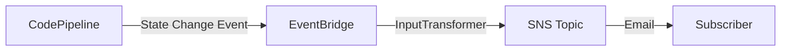

# Design Document: Pipeline Notification Formatting

## Overview

This design addresses the poor readability of pipeline email notifications in the Atlantis CloudFormation pipeline templates. Currently, the three EventBridge rules (Started, Succeeded, Failed) in `template-pipeline.yml` (CodeCommit), `template-pipeline-github.yml` (GitHub), and `template-pipeline-build-only.yml` (CodeCommit build-only) use an `InputTransformer` that wraps the notification payload in a JSON object with `"Subject"` and `"Message"` keys. The current templates use the YAML `|` (literal block scalar) indicator, which appends a trailing newline to the rendered string. This causes EventBridge to deliver the entire string as a raw SNS message body rather than parsing the JSON and mapping `Subject`/`Message` to the SNS Publish API parameters. The result is that email recipients see JSON syntax artifacts (`{`, `}`, `"Message":`, escaped `\n`) instead of a clean, human-readable message.

### Design Decision

The fix restructures the `InputTemplate` in each EventBridge rule to:

1. Use a properly formatted JSON object with only `"Subject"` and `"Message"` keys and no trailing newline — switching from YAML `|` to `>-` (folded block scalar, strip trailing newline) or a quoted string so EventBridge correctly maps the keys to SNS Publish parameters.
2. Format the `"Message"` value as a multi-line plain-text string with labeled fields, blank-line separation, and a console link.
3. Use `"ALERT: Pipeline <pipeline> Failed"` as the subject for failure events.
4. Include a call-to-action line only in failure messages.
5. Apply identical formatting to all three template files.

## Architecture

The notification system uses three AWS services in sequence:



Each pipeline template defines:
- 1 SNS Topic (`PipelineNotificationTopic`) with an email subscription
- 3 EventBridge Rules (Started, Succeeded, Failed), each with an `InputTransformer`
- 1 SNS Topic Policy allowing EventBridge to publish

The `InputTransformer` has two parts:
- `InputPathsMap`: Extracts fields from the CodePipeline event (`pipeline`, `state`, `executionId`, `time`)
- `InputTemplate`: Formats extracted fields into the SNS payload

No new resources are created. Only the `InputTemplate` value in each of the 9 EventBridge rule targets (3 per template) is modified.

### Change Scope

| File | Resources Modified | Change Type |
|------|-------------------|-------------|
| `templates/v2/pipeline/template-pipeline.yml` | `PipelineStartedRule`, `PipelineSucceededRule`, `PipelineFailedRule` | `InputTemplate` value only |
| `templates/v2/pipeline/template-pipeline-github.yml` | `PipelineStartedRule`, `PipelineSucceededRule`, `PipelineFailedRule` | `InputTemplate` value only |
| `templates/v2/pipeline/template-pipeline-build-only.yml` | `PipelineStartedRule`, `PipelineSucceededRule`, `PipelineFailedRule` | `InputTemplate` value only |

This is a non-breaking change — only the content of notification emails changes. No parameters, resource logical IDs, outputs, or IAM policies are affected.

## Components and Interfaces

### InputTransformer Configuration

Each EventBridge rule target uses the same `InputPathsMap`:

```yaml
InputPathsMap:
  "pipeline": "$.detail.pipeline"
  "state": "$.detail.state"
  "executionId": "$.detail.execution-id"
  "time": "$.time"
```

The `InputTemplate` is the only component that changes. It must produce a JSON object with `Subject` and `Message` keys that EventBridge maps to SNS Publish parameters.

### New InputTemplate Format

**Started:**
```
Subject: "Pipeline <pipeline> Started"
Message:
  Pipeline Execution - STARTED

  Status: STARTED
  Pipeline: <pipeline>
  Execution ID: <executionId>
  Time: <time>

  Console Link: https://<region>.console.aws.amazon.com/codesuite/codepipeline/pipelines/<pipeline-name>/view?region=<region>
```

**Succeeded:**
```
Subject: "Pipeline <pipeline> Succeeded"
Message:
  Pipeline Execution - SUCCEEDED

  Status: SUCCEEDED
  Pipeline: <pipeline>
  Execution ID: <executionId>
  Time: <time>

  Console Link: https://<region>.console.aws.amazon.com/codesuite/codepipeline/pipelines/<pipeline-name>/view?region=<region>
```

**Failed:**
```
Subject: "ALERT: Pipeline <pipeline> Failed"
Message:
  Pipeline Execution - FAILED

  Status: FAILED
  Pipeline: <pipeline>
  Execution ID: <executionId>
  Time: <time>

  Please check the pipeline for errors.
  Console Link: https://<region>.console.aws.amazon.com/codesuite/codepipeline/pipelines/<pipeline-name>/view?region=<region>
```

### Actual YAML InputTemplate (Started example)

```yaml
InputTemplate: !Sub >-
  {
    "Subject": "Pipeline <pipeline> Started",
    "Message": "Pipeline Execution - STARTED\n\nStatus: STARTED\nPipeline: <pipeline>\nExecution ID: <executionId>\nTime: <time>\n\nConsole Link: https://${AWS::Region}.console.aws.amazon.com/codesuite/codepipeline/pipelines/${Prefix}-${ProjectId}-${StageId}-Pipeline/view?region=${AWS::Region}"
  }
```

Key formatting decisions:
- Use `>-` (folded block scalar with strip chomping) to avoid the trailing newline that `|` adds. The trailing newline from `|` causes EventBridge to treat the payload as a raw string rather than parsing the JSON into SNS Publish parameters.
- `\n` within the `"Message"` value produces actual newlines in the email body.
- A blank line (`\n\n`) separates the header summary from the detail fields and the detail fields from the console link section.
- The `"Subject"` and `"Message"` are the only top-level keys so EventBridge correctly maps them to SNS Publish parameters.

## Data Models

### EventBridge CodePipeline Event (Input)

```json
{
  "version": "0",
  "id": "event-id",
  "detail-type": "CodePipeline Pipeline Execution State Change",
  "source": "aws.codepipeline",
  "time": "2025-01-15T10:30:00Z",
  "detail": {
    "pipeline": "acme-myapp-prod-Pipeline",
    "execution-id": "abc-123-def-456",
    "state": "STARTED"
  }
}
```

### InputTransformer Output (SNS Payload)

The `InputTemplate` renders to a JSON object that EventBridge maps to SNS Publish parameters:

```json
{
  "Subject": "Pipeline acme-myapp-prod-Pipeline Started",
  "Message": "Pipeline Execution - STARTED\n\nStatus: STARTED\nPipeline: acme-myapp-prod-Pipeline\nExecution ID: abc-123-def-456\nTime: 2025-01-15T10:30:00Z\n\nConsole Link: https://us-east-1.console.aws.amazon.com/codesuite/codepipeline/pipelines/acme-myapp-prod-Pipeline/view?region=us-east-1"
}
```

### Rendered Email (Output)

**Subject:** `Pipeline acme-myapp-prod-Pipeline Started`

**Body:**
```
Pipeline Execution - STARTED

Status: STARTED
Pipeline: acme-myapp-prod-Pipeline
Execution ID: abc-123-def-456
Time: 2025-01-15T10:30:00Z

Console Link: https://us-east-1.console.aws.amazon.com/codesuite/codepipeline/pipelines/acme-myapp-prod-Pipeline/view?region=us-east-1
```

### Field Mapping

| Email Field | Source | Label |
|-------------|--------|-------|
| Subject | Constructed from state + pipeline name | N/A |
| Header line | State value | "Pipeline Execution - {STATE}" |
| Status | `$.detail.state` | "Status:" |
| Pipeline | `$.detail.pipeline` | "Pipeline:" |
| Execution ID | `$.detail.execution-id` | "Execution ID:" |
| Time | `$.time` | "Time:" |
| Console Link | Constructed from region + pipeline name | "Console Link:" |
| Call-to-action | Static text (FAILED only) | "Please check the pipeline for errors." |


## Correctness Properties

*A property is a characteristic or behavior that should hold true across all valid executions of a system — essentially, a formal statement about what the system should do. Properties serve as the bridge between human-readable specifications and machine-verifiable correctness guarantees.*

### Property 1: Message body contains labeled fields on separate lines with section separation

*For any* valid pipeline name, execution ID, timestamp, and pipeline state (STARTED, SUCCEEDED, FAILED), the rendered Notification_Message must contain the labels "Status:", "Pipeline:", "Execution ID:", "Time:", and "Console Link:" each on its own line, and must include at least one blank line (double newline) separating the header summary from the detail fields.

**Validates: Requirements 1.1, 1.2, 1.3**

### Property 2: Subject line contains pipeline name and state-appropriate text with ALERT prefix only for failures

*For any* valid pipeline name and pipeline state, the rendered Notification_Subject must contain the pipeline name and a state-descriptive word ("Started", "Succeeded", or "Failed"). If and only if the state is FAILED, the subject must begin with "ALERT:".

**Validates: Requirements 2.1, 2.2, 2.3**

### Property 3: Call-to-action text appears if and only if state is FAILED

*For any* valid pipeline name and pipeline state, the rendered Notification_Message contains a call-to-action prompt (e.g., "Please check the pipeline for errors") if and only if the state is FAILED. For STARTED and SUCCEEDED states, the message must include the Console_Link but must not contain the error-specific call-to-action.

**Validates: Requirements 3.1, 3.2**

### Property 4: Rendered subject and message are plain text without JSON or HTML artifacts

*For any* valid pipeline name, execution ID, timestamp, and pipeline state, the rendered Notification_Message value must not contain JSON structural characters (`{`, `}`, `"Message":`, `"Subject":`) and must not contain HTML tags. The rendered Notification_Subject must similarly be free of JSON structural syntax.

**Validates: Requirements 1.4, 5.1, 5.2**

### Property 5: InputTemplate output is valid JSON with exactly Subject and Message keys

*For any* valid pipeline name, execution ID, timestamp, and pipeline state, the full InputTemplate output (before SNS processing) must be a valid JSON object containing exactly two top-level keys: `"Subject"` and `"Message"`, so that EventBridge correctly maps them to SNS Publish parameters.

**Validates: Requirements 5.3**

### Property 6: Template parity across all three pipeline variants

*For any* EventBridge rule type (Started, Succeeded, Failed), the InputTemplate structure and format in `template-pipeline.yml` must be identical to the corresponding InputTemplate in `template-pipeline-github.yml` and `template-pipeline-build-only.yml` — same labels, same field order, same blank-line placement, same subject format.

**Validates: Requirements 4.1**

## Error Handling

This feature modifies static CloudFormation template content (InputTemplate strings). There is no runtime error handling to implement. Potential issues and mitigations:

| Scenario | Mitigation |
|----------|------------|
| Malformed JSON in InputTemplate | Validate templates with `cfn-lint` before deployment. Unit tests parse the InputTemplate and verify valid JSON structure. |
| SNS treats payload as raw string instead of parsing Subject/Message | Ensure no trailing newline after the JSON closing brace. Use YAML `>` folded scalar or carefully quoted strings. Test with actual deployment. |
| EventBridge placeholder not resolved | InputPathsMap already maps all used placeholders. No new placeholders are introduced. |
| Email client renders `\n` literally | SNS email delivery converts `\n` to actual newlines in plain-text emails. This is standard SNS behavior. |

## Testing Strategy

### Testing Approach

The testing strategy uses unit tests as the primary mechanism, with minimal property-based tests where they add unique value. This aligns with the project's testing guidelines that prioritize fast-running unit tests.

### Unit Tests

Unit tests will validate the InputTemplate content by parsing the YAML templates and inspecting the rendered notification strings. Tests will be added to a new test file `tests/test_pipeline_notifications_unit.py`.

Test cases:
1. **Template parsing**: Load all three pipeline YAML files and extract the InputTemplate from each EventBridge rule.
2. **JSON structure**: Verify each InputTemplate renders to valid JSON with exactly `Subject` and `Message` keys.
3. **Subject format per state**: Verify Started/Succeeded subjects contain pipeline name and state word. Verify Failed subject starts with "ALERT:".
4. **Message body labels**: Verify each message contains "Status:", "Pipeline:", "Execution ID:", "Time:", "Console Link:" labels.
5. **Blank line separation**: Verify messages contain `\n\n` for visual section separation.
6. **Call-to-action for FAILED only**: Verify FAILED message contains error prompt; STARTED and SUCCEEDED do not.
7. **No JSON artifacts in message/subject values**: Verify the `Message` and `Subject` values don't contain `{`, `}`, or JSON key syntax.
8. **Template parity**: Compare InputTemplate structures across all three template files for each rule type.

### Property-Based Tests

Per the project's testing guidelines, property-based tests are kept minimal. One property test file `tests/test_pipeline_notifications_property.py` will cover the core formatting invariants using `hypothesis`.

Property tests (10-20 iterations per the project guidelines):
- **Feature: pipeline-notification-formatting, Property 1**: Generate random pipeline names, execution IDs, and timestamps. Substitute into the message template. Verify labeled fields appear on separate lines with blank-line separation.
- **Feature: pipeline-notification-formatting, Property 2**: Generate random pipeline names. For each state, verify subject contains pipeline name and correct state word, with ALERT: prefix only for FAILED.
- **Feature: pipeline-notification-formatting, Property 4**: Generate random pipeline names and field values. Verify rendered subject and message contain no JSON/HTML artifacts.

Properties 3, 5, and 6 are adequately covered by unit tests (Property 3 has only 3 discrete states to check, Property 5 is a static JSON parse, Property 6 is a direct file comparison).

### Test Configuration

- Property-based testing library: `hypothesis` (already present in the project)
- Iterations per property test: 20 (per project testing guidelines for fast execution)
- Each property test tagged with: `Feature: pipeline-notification-formatting, Property {N}: {description}`
- Total test suite target: under 30 seconds
