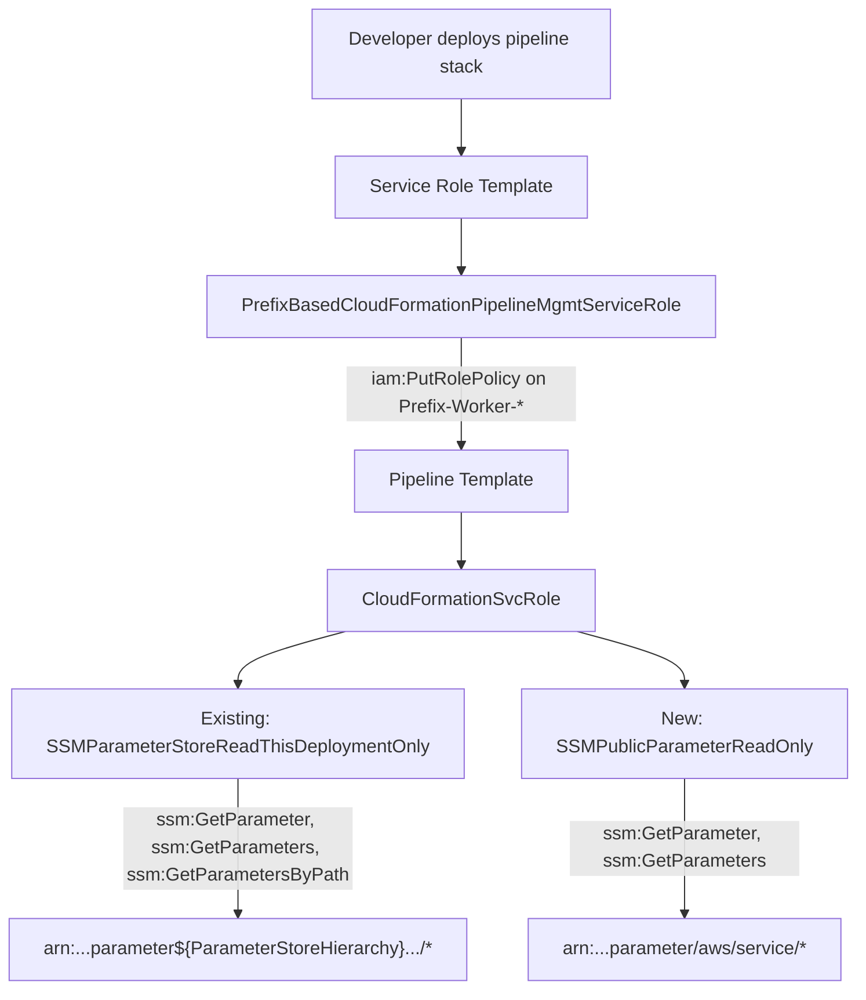

# Design Document: Pipeline SSM Parameter Access

## Overview

This feature adds `ssm:GetParameter` and `ssm:GetParameters` permissions for public AWS SSM parameters (under `/aws/service/*`) to the `CloudFormationSvcRole` in the pipeline template. It also ensures the service role template (`template-service-role-pipeline.yml`) permits deploying the updated pipeline stack.

Currently, the `CloudFormationSvcRole` only has SSM read access scoped to the application-specific `ParameterStoreHierarchy`. When application templates use `{{resolve:ssm:/aws/service/...}}` dynamic references, CloudFormation fails because it lacks permission to read those public AWS-published parameters. This design adds a new, separate IAM policy statement to grant that access while preserving existing permissions and maintaining least privilege.

The service role template already grants `iam:PutRolePolicy` on `${Prefix}-Worker-*` roles, which covers the `CloudFormationSvcRole` (named `${Prefix}-Worker-${ProjectId}-${StageId}-CloudFormationSvcRole`). Since the new SSM statement is an inline policy on that role, the existing service role permissions are sufficient — no changes to the service role template are needed.

## Architecture

The change is scoped to a single CloudFormation template file with no new resources or architectural shifts.



### Change Summary

1. **Pipeline Template (`template-pipeline.yml`)**: Add a new IAM policy statement `SSMPublicParameterReadOnly` to the `CloudFormationSvcRole` inline policy, granting `ssm:GetParameter` and `ssm:GetParameters` on `arn:aws:ssm:${AWS::Region}:${AWS::AccountId}:parameter/aws/service/*`.

2. **Service Role Template (`template-service-role-pipeline.yml`)**: No changes required. The existing `ManageWorkerRolesByResourcePrefix` statement already grants `iam:PutRolePolicy` on `${Prefix}-Worker-*` roles, which covers the `CloudFormationSvcRole`.

### Design Decisions

- **Separate Sid**: The new statement uses `SSMPublicParameterReadOnly` as its Sid, distinct from the existing `SSMParameterStoreReadThisDeploymentOnly`. This makes the intent clear and allows independent auditing of public vs. application-specific SSM access.
- **Read-only actions only**: Only `ssm:GetParameter` and `ssm:GetParameters` are granted — no `ssm:GetParametersByPath`, `ssm:PutParameter`, or other write actions. This is the minimum needed for `{{resolve:ssm:...}}` dynamic references.
- **No service role changes**: The service role already permits `iam:PutRolePolicy` on worker roles. Adding an inline policy statement to the `CloudFormationSvcRole` does not require additional service role permissions.
- **Non-breaking change**: This adds a new IAM policy statement without modifying any existing statements, parameters, resources, or outputs. Per the version control steering document, this is a PATCH-level change.

## Components and Interfaces

### Modified Component: CloudFormationSvcRole (template-pipeline.yml)

The `CloudFormationSvcRole` IAM role's inline policy (`CloudFormationRolePolicy`) gains one new statement:

```yaml
- Sid: "SSMPublicParameterReadOnly"
  Action:
  - ssm:GetParameter
  - ssm:GetParameters
  Effect: Allow
  Resource:
    !Sub "arn:aws:ssm:${AWS::Region}:${AWS::AccountId}:parameter/aws/service/*"
```

This statement is placed immediately after the existing `SSMParameterStoreReadThisDeploymentOnly` statement for logical grouping.

### Unchanged Component: PrefixBasedCloudFormationPipelineMgmtServiceRole (template-service-role-pipeline.yml)

No modifications. The existing `ManageWorkerRolesByResourcePrefix` Sid already allows `iam:PutRolePolicy` on `arn:aws:iam::${AWS::AccountId}:role${RolePath}${Prefix}-Worker-*`, which covers the `CloudFormationSvcRole`.

## Data Models

No new data models, parameters, conditions, mappings, or outputs are introduced. The change is limited to adding a single IAM policy statement to an existing inline policy document.


## Correctness Properties

*A property is a characteristic or behavior that should hold true across all valid executions of a system — essentially, a formal statement about what the system should do. Properties serve as the bridge between human-readable specifications and machine-verifiable correctness guarantees.*

### Property 1: Public SSM statement exists with correct actions and distinct Sid

*For any* loaded pipeline template, the `CloudFormationSvcRole` inline policy SHALL contain a statement with a Sid distinct from `SSMParameterStoreReadThisDeploymentOnly` that includes both `ssm:GetParameter` and `ssm:GetParameters` in its Action list.

**Validates: Requirements 1.1, 1.2, 1.5**

### Property 2: Existing application-specific SSM statement is preserved

*For any* loaded pipeline template, the `CloudFormationSvcRole` inline policy SHALL contain a statement with Sid `SSMParameterStoreReadThisDeploymentOnly` that includes `ssm:GetParameter`, `ssm:GetParameters`, and `ssm:GetParametersByPath` in its Action list, with a Resource referencing the `ParameterStoreHierarchy` parameter.

**Validates: Requirements 1.4**

### Property 3: Public SSM resource ARN is scoped to /aws/service/* only

*For any* loaded pipeline template, the resource ARN in the public SSM parameter statement SHALL contain the path `parameter/aws/service/*` and SHALL reference `${AWS::Region}` and `${AWS::AccountId}` for region and account scoping, and SHALL NOT grant access to SSM parameters outside the `/aws/service/*` hierarchy.

**Validates: Requirements 3.1, 3.3**

### Property 4: Public SSM statement grants only read-only actions

*For any* loaded pipeline template, the public SSM parameter statement SHALL contain only `ssm:GetParameter` and `ssm:GetParameters` as actions, and SHALL NOT include any write actions (such as `ssm:PutParameter`, `ssm:DeleteParameter`) or broader read actions (such as `ssm:GetParametersByPath`).

**Validates: Requirements 3.2**

## Error Handling

This feature does not introduce new error handling logic. The change is purely additive IAM permissions. Potential error scenarios:

- **Missing permissions**: If the new statement is omitted or misconfigured, CloudFormation will return an `AccessDenied` error when resolving `{{resolve:ssm:/aws/service/...}}` dynamic references. This is the existing failure mode that this feature resolves.
- **Overly broad permissions**: If the resource ARN pattern is broader than `/aws/service/*`, it would violate least privilege. The correctness properties above guard against this.
- **Service role deployment failure**: If the service role template did not permit `iam:PutRolePolicy` on worker roles, deploying the updated pipeline stack would fail. Analysis confirms the existing service role already grants this permission.

## Testing Strategy

### Unit Tests

Unit tests verify specific structural expectations about the template YAML:

- Verify the `SSMPublicParameterReadOnly` statement exists in the `CloudFormationSvcRole` policy
- Verify the existing `SSMParameterStoreReadThisDeploymentOnly` statement is unchanged
- Verify the service role template's `ManageWorkerRolesByResourcePrefix` statement includes `iam:PutRolePolicy`
- Verify the new statement's Effect is `Allow`

### Property-Based Tests

Per the project's testing guidelines, property-based tests should be minimal and only used where they provide significant value over unit tests. Since this feature modifies a controlled set of CloudFormation templates (not a complex input space), the focus is on unit tests.

However, a small set of property tests can validate structural invariants:

- **Property 1**: Load the template and verify the new SSM statement has correct actions and a distinct Sid
- **Property 2**: Load the template and verify the existing SSM statement is preserved with its original actions and resource
- **Property 3**: Verify the resource ARN pattern is scoped to `/aws/service/*`
- **Property 4**: Verify only read-only SSM actions are present in the new statement

Property-based testing library: `hypothesis` (already used in the project — see `tests/test_network_template_property.py`)

Each property test should reference its design property:
- Tag format: **Feature: pipeline-ssm-parameter-access, Property {number}: {property_text}**
- Iterations: 10-20 per test (per project testing guidelines for fast execution)

### Test File Organization

- Unit tests: `tests/test_pipeline_ssm_access_unit.py`
- Property tests: `tests/test_pipeline_ssm_access_property.py`

Both test files use the existing `cfn_test_utils.load_template()` utility to load and parse the CloudFormation templates.
