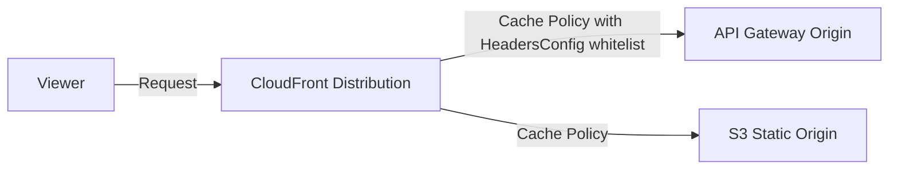
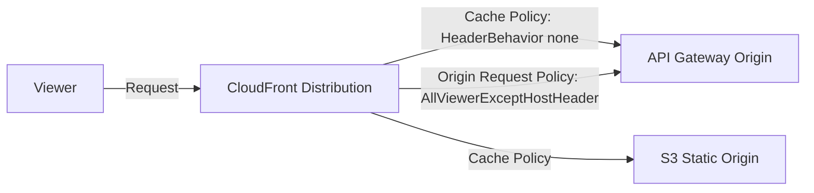

# Design Document

## Overview

This design adds the AWS managed Origin Request Policy "AllViewerExceptHostHeader" (ID: `b689b0a8-53d0-40ab-baf2-68738e2966ac`) to API Gateway cache behaviors in the `template-network-route53-cloudfront-s3-apigw.yml` CloudFormation template. The origin request policy forwards all viewer headers, cookies, and query strings to the API Gateway origin except the Host header, which must remain set to the API Gateway domain for proper routing.

Currently, the template uses the `HeadersToForwardToApi` parameter with a custom cache policy (`CloudFrontCachePolicyApi`) to whitelist specific headers via `HeadersConfig`. This approach conflates cache key configuration with origin forwarding. The modern approach separates these concerns: the cache policy controls what goes into the cache key, and the origin request policy controls what gets forwarded to the origin.

### Key Design Decisions

1. **Use AWS managed policy, not a custom resource**: The AllViewerExceptHostHeader policy is an AWS managed origin request policy with a well-known fixed ID. No custom `AWS::CloudFront::OriginRequestPolicy` resource needs to be created — the ID is referenced directly on cache behaviors.

2. **Hardcode the policy ID**: The managed policy ID `b689b0a8-53d0-40ab-baf2-68738e2966ac` is a stable AWS-managed identifier. It is hardcoded directly in the template rather than parameterized, since there is no user-facing reason to change it.

3. **Deprecate rather than remove `HeadersToForwardToApi`**: The parameter is retained with its existing default value for backward compatibility. Existing stacks that pass this parameter will not break on update. The parameter value is simply no longer used.

4. **No new parameters or conditions**: The origin request policy is unconditionally applied to all API behaviors. No new parameters, conditions, or mappings are needed.

## Architecture

The change affects the CloudFront distribution resource (`CloudFrontDistribution`) within the existing template. No new resources are created. The architecture remains the same — CloudFront distribution with S3 and/or API Gateway origins.

### Before (Current State)



Headers forwarded to API Gateway are controlled by the `HeadersConfig` section of `CloudFrontCachePolicyApi`, which uses the `HeadersToForwardToApi` parameter. This means forwarded headers also become part of the cache key.

### After (Target State)



Headers forwarded to API Gateway are controlled by the origin request policy, independent of the cache key. The cache policy's `HeadersConfig` is set to `none`.

## Components and Interfaces

### Affected Template Sections

The changes span four sections of the template:

#### 1. Metadata — Parameter Groups

**Change**: Update the label for the "API behind CloudFront Forwarding" parameter group to indicate deprecation.

**Current**:
```yaml
- Label:
    default: API behind CloudFront Forwarding
  Parameters:
    - HeadersToForwardToApi
```

**Target**:
```yaml
- Label:
    default: "API behind CloudFront Forwarding (Deprecated)"
  Parameters:
    - HeadersToForwardToApi
```

#### 2. Parameters — HeadersToForwardToApi

**Change**: Update the description to indicate deprecation. Retain the parameter and its default value.

**Current description**: Explains header forwarding for API behind CloudFront.

**Target description**: Adds deprecation notice explaining that header forwarding is now handled by the AllViewerExceptHostHeader origin request policy.

#### 3. Conditions — HasHeadersToForwardToApi

**Change**: Remove the `HasHeadersToForwardToApi` condition entirely. It is no longer referenced by any resource.

#### 4. Resources — CloudFrontDistribution

**Changes to DefaultCacheBehavior**:
- Add `OriginRequestPolicyId: b689b0a8-53d0-40ab-baf2-68738e2966ac` when the default behavior serves API content (i.e., when `StaticOriginIsRoot` is false and `ApiIsBehindCloudFront` is true). When `StaticOriginIsRoot` is true, no origin request policy is set on the default behavior.
- Implementation: Use `!If [StaticOriginIsRoot, !Ref "AWS::NoValue", "b689b0a8-53d0-40ab-baf2-68738e2966ac"]` to conditionally apply the policy.

**Changes to CacheBehaviors (API path behavior)**:
- Add `OriginRequestPolicyId: b689b0a8-53d0-40ab-baf2-68738e2966ac` to the API path cache behavior (the one gated by `HasRouteForApiInCloudFront`).

**No changes to CacheBehaviors (Static path behavior)**:
- The static path cache behavior does NOT get an origin request policy.

#### 5. Resources — CloudFrontCachePolicyApi

**Change**: Replace the conditional `HeadersConfig` block with a static `HeaderBehavior: none`.

**Current**:
```yaml
HeadersConfig: !If 
  - HasHeadersToForwardToApi
  - HeaderBehavior: whitelist
    Headers: !Ref HeadersToForwardToApi
  - HeaderBehavior: none
```

**Target**:
```yaml
HeadersConfig:
  HeaderBehavior: none
```

#### 6. Version Increment

**Change**: Increment template version from `v0.0.17` to `v0.0.18` and update the date. The current PATCH version is 17 (> 0), so a PATCH increment is required per the version control steering document.

### Unchanged Components

- **S3 Origin**: No changes to static origin configuration
- **Route53 records**: No changes to DNS configuration
- **API Gateway domain**: No changes to API Gateway custom domain
- **CloudFrontCachePolicyStatic**: No changes to static cache policy
- **CloudFrontOriginAccessControl**: No changes to OAC
- **Outputs**: No changes needed — no new resources are created
- **Mappings**: No changes needed

## Data Models

No new data models are introduced. The change modifies existing CloudFormation resource properties:

### OriginRequestPolicyId Property

| Property | Type | Value |
|----------|------|-------|
| `OriginRequestPolicyId` | String | `b689b0a8-53d0-40ab-baf2-68738e2966ac` |

This is a standard CloudFront distribution cache behavior property. See [AWS::CloudFront::Distribution CacheBehavior](https://docs.aws.amazon.com/AWSCloudFormation/latest/UserGuide/aws-properties-cloudfront-distribution-cachebehavior.html).

### Condition Matrix for OriginRequestPolicyId

| Behavior | Condition | Gets OriginRequestPolicyId? |
|----------|-----------|----------------------------|
| DefaultCacheBehavior (API is root) | `StaticOriginIsRoot` = false, `ApiIsBehindCloudFront` = true | Yes |
| DefaultCacheBehavior (Static is root) | `StaticOriginIsRoot` = true | No |
| Path-based API behavior | `HasRouteForApiInCloudFront` = true | Yes |
| Path-based Static behavior | `HasRouteForStaticOrigin` = true | No |

## Error Handling

### Backward Compatibility

- **Existing stacks with `HeadersToForwardToApi` set**: The parameter is retained. Stacks that pass a value for this parameter will not fail on update. The value is simply ignored since the cache policy no longer references it.
- **Existing stacks with default `HeadersToForwardToApi`**: No change needed. The default value remains but is unused.

### CloudFormation Update Behavior

- Adding `OriginRequestPolicyId` to a cache behavior is a non-destructive, in-place update to the CloudFront distribution. It does not trigger distribution replacement.
- Changing `HeadersConfig` from `whitelist` to `none` in the cache policy is also a non-destructive update.
- Removing the `HasHeadersToForwardToApi` condition is safe because no resource references it after the `HeadersConfig` change.

### Potential Issues

- **cfn-lint validation**: The hardcoded origin request policy ID should pass cfn-lint validation as it is a valid string value for the `OriginRequestPolicyId` property.
- **Condition removal**: Removing `HasHeadersToForwardToApi` is safe only if no other resource or output references it. The current template only uses it in `CloudFrontCachePolicyApi.HeadersConfig`, which is being changed.

## Testing Strategy

### PBT Applicability Assessment

Property-based testing is **NOT applicable** for this feature. The changes are purely declarative CloudFormation template modifications (IaC). There are no pure functions, parsers, serializers, or algorithmic logic to test with generated inputs. The template is a static YAML configuration file.

### Testing Approach

Testing focuses on **cfn-lint validation** and **unit tests** to verify the template structure:

1. **cfn-lint validation**: Run the existing cfn-lint validation pipeline against the modified template to ensure it remains valid CloudFormation.

2. **Unit tests** (example-based):
   - Verify the `OriginRequestPolicyId` value is present in the API path cache behavior
   - Verify the `OriginRequestPolicyId` is conditionally present in the DefaultCacheBehavior (only when API is root)
   - Verify the static path cache behavior does NOT have an `OriginRequestPolicyId`
   - Verify `HeadersConfig` in `CloudFrontCachePolicyApi` is set to `HeaderBehavior: none`
   - Verify the `HasHeadersToForwardToApi` condition is removed
   - Verify the `HeadersToForwardToApi` parameter still exists with its default value
   - Verify the parameter description contains deprecation notice
   - Verify the metadata group label contains "(Deprecated)"
   - Verify the template version is incremented to `v0.0.18`

3. **Manual validation** (post-deployment):
   - Deploy updated template to a test environment
   - Verify CloudFront distribution applies the origin request policy to API behaviors
   - Verify headers (e.g., User-Agent) are forwarded to API Gateway
   - Verify static content behaviors are unaffected
