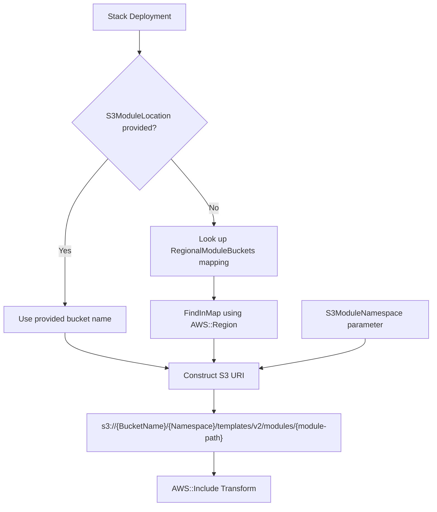

# Design Document

## Overview

This design covers the modification of 6 CloudFormation templates to support regional S3 bucket resolution for `AWS::Include` module imports. Currently, all templates hard-code `63klabs/atlantis` as a combined bucket/path value in the `S3ModuleLocation` parameter. This forces deployments into the same region as that single bucket (us-east-2).

The new design separates bucket resolution from namespace (path prefix) by:
1. Changing `S3ModuleLocation` to accept only a bucket name (empty by default)
2. Adding `S3ModuleNamespace` for the path prefix (default: `atlantis`)
3. Adding a `RegionalModuleBuckets` mapping for 4 US regions
4. Adding a `HasS3ModuleLocation` condition to detect user overrides
5. Updating all `AWS::Include` Location references to use conditional bucket resolution

This enables multi-region deployment without manual bucket specification while preserving the ability to override with a custom bucket.

### Design Decisions

1. **Empty default for S3ModuleLocation**: Using an empty string as the default (rather than a specific bucket name) makes the mapping the primary resolution mechanism. This avoids coupling the template to any single bucket and makes regional deployment the default behavior.

2. **Separate namespace parameter**: Extracting the namespace into its own parameter allows users to point at different module versions (e.g., `atlantis-v2`) without changing bucket configuration.

3. **`!Sub` with variable map pattern**: Using `!Sub` with an explicit variable map (rather than nested `!Sub` calls) keeps the Location references readable and allows the `!If`/`!FindInMap` logic to be expressed cleanly within CloudFormation's intrinsic function constraints.

4. **4-region mapping**: The mapping covers `us-east-1`, `us-east-2`, `us-west-1`, and `us-west-2`. Deploying to an unsupported region without providing an `S3ModuleLocation` override will fail at the `!FindInMap` lookup — this is intentional and provides a clear error signal.

## Architecture

The change is structural — no new AWS resources are created. The architecture remains the same: templates use `Fn::Transform` with `AWS::Include` to pull module snippets from S3 at deploy time. The only change is how the S3 URI is constructed.



### Resolution Flow

1. CloudFormation evaluates the `HasS3ModuleLocation` condition
2. For each `AWS::Include` Location:
   - If condition is true: use `!Ref S3ModuleLocation` as bucket name
   - If condition is false: use `!FindInMap [RegionalModuleBuckets, !Ref "AWS::Region", BucketName]`
3. The namespace is always `!Ref S3ModuleNamespace`
4. The full URI is assembled via `!Sub` with a variable map

## Components and Interfaces

### Modified Components (per template)

Each of the 6 templates receives identical structural additions:

#### 1. S3ModuleLocation Parameter (modified)

```yaml
S3ModuleLocation:
  Type: String
  Description: "S3 bucket name override for module snippets. Leave empty to use the default regional bucket from the RegionalModuleBuckets mapping. If specified, modules are loaded from s3://<S3ModuleLocation>/<S3ModuleNamespace>/templates/v2/modules/*"
  Default: ""
  AllowedPattern: "^$|^[a-z0-9][a-z0-9-]{1,61}[a-z0-9]$"
  ConstraintDescription: "Must be empty or a valid S3 bucket name between 3 and 63 characters containing only lowercase letters, numbers, and hyphens."
```

#### 2. S3ModuleNamespace Parameter (new)

```yaml
S3ModuleNamespace:
  Type: String
  Description: "Namespace prefix within the S3 module bucket. This is the path prefix where modules are stored. Modules are loaded from s3://<BucketName>/<S3ModuleNamespace>/templates/v2/modules/*"
  Default: "atlantis"
  AllowedPattern: "^[a-z0-9][a-z0-9\\-]*(\\/[a-z0-9][a-z0-9\\-]*)*$"
  MinLength: 1
  MaxLength: 128
  ConstraintDescription: "Must be 1 to 128 characters containing only lowercase alphanumeric characters, hyphens, and forward slashes. Must not start or end with a slash. Each segment between slashes must start with a lowercase alphanumeric character."
```

#### 3. RegionalModuleBuckets Mapping (new section)

```yaml
Mappings:
  RegionalModuleBuckets:
    us-east-1:
      BucketName: 63klabs-atlas-us-east-1
    us-east-2:
      BucketName: 63klabs-zenith-us-east-2
    us-west-1:
      BucketName: 63klabs-fabric-us-west-1
    us-west-2:
      BucketName: 63klabs-orbit-us-west-2
```

#### 4. HasS3ModuleLocation Condition (new)

```yaml
HasS3ModuleLocation: !Not [!Equals [!Ref S3ModuleLocation, ""]]
```

#### 5. Include Location Pattern (modified)

Before:
```yaml
Location: !Sub "s3://${S3ModuleLocation}/templates/v2/modules/management-roles/pipeline-mgmt-role.yml"
```

After:
```yaml
Location: !Sub
  - "s3://${BucketName}/${Namespace}/templates/v2/modules/management-roles/pipeline-mgmt-role.yml"
  - BucketName: !If
      - HasS3ModuleLocation
      - !Ref S3ModuleLocation
      - !FindInMap [RegionalModuleBuckets, !Ref "AWS::Region", BucketName]
    Namespace: !Ref S3ModuleNamespace
```

#### 6. Metadata Parameter Group (modified)

The "Module Source" parameter group is updated to include both parameters:
```yaml
-
  Label:
    default: "Module Source"
  Parameters:
    - S3ModuleLocation
    - S3ModuleNamespace
```

### Templates and Their Include Counts

| Template | AWS::Include Count |
|----------|-------------------|
| account-wide-infrastructure.yml | 5 |
| prefix-based-infrastructure.yml | 10 |
| template-service-role-pipeline.yml | 2 |
| template-service-role-network-cloudfront.yml | 3 |
| template-service-role-network-full.yml | 4 |
| template-service-role-storage.yml | 2 |

Each `AWS::Include` Location reference in every template must be updated to use the new `!Sub` variable map pattern. The only difference between references is the `<module-path>` segment.

## Data Models

No new data models are introduced. The change is purely structural within CloudFormation template YAML. The mapping data is static configuration:

| Region | Bucket Name |
|--------|-------------|
| us-east-1 | 63klabs-atlas-us-east-1 |
| us-east-2 | 63klabs-zenith-us-east-2 |
| us-west-1 | 63klabs-fabric-us-west-1 |
| us-west-2 | 63klabs-orbit-us-west-2 |

## Error Handling

### Unsupported Region Deployment

If a user deploys to a region not in the mapping (e.g., `eu-west-1`) without providing an `S3ModuleLocation` override, CloudFormation will fail with a mapping lookup error during template processing. This is the desired behavior — it provides a clear signal that the region is not supported for default bucket resolution.

### Invalid S3ModuleLocation

The `AllowedPattern` regex (`^$|^[a-z0-9][a-z0-9-]{1,61}[a-z0-9]$`) rejects values containing forward slashes, uppercase characters, or other invalid bucket name characters at parameter validation time, before any resources are created.

### Invalid S3ModuleNamespace

The `AllowedPattern` regex ensures the namespace is well-formed (no leading/trailing slashes, valid segment characters). Invalid values are rejected at parameter validation time.

### Module Not Found

If the bucket exists but the module path doesn't resolve (wrong namespace, missing file), the `AWS::Include` transform will fail with an S3 access error. This behavior is unchanged from the current implementation.

## Correctness Properties

Since this feature modifies declarative CloudFormation template YAML (not application logic), formal correctness properties are expressed as structural invariants verified through unit tests rather than property-based testing:

### Property 1: Parameter Isolation

**Validates: Requirements 1.4, 1.6**

The S3ModuleLocation parameter SHALL NOT accept values containing forward slashes — bucket name and namespace are always separate concerns. The AllowedPattern `^$|^[a-z0-9][a-z0-9-]{1,61}[a-z0-9]$` enforces this by rejecting any value with a `/` character.

### Property 2: Regional Resolution Completeness

**Validates: Requirements 3.1, 3.2, 3.3, 3.4, 3.5, 3.6**

For every region key in the RegionalModuleBuckets mapping, the corresponding bucket name SHALL be non-empty and follow S3 bucket naming rules. The mapping SHALL contain exactly 4 entries (us-east-1, us-east-2, us-west-1, us-west-2) with their designated bucket names.

### Property 3: Cross-Template Consistency

**Validates: Requirements 6.7, 6.8, 6.9**

The parameter definitions, mapping entries, condition logic, and `!Sub` variable map structure SHALL be character-for-character identical across all 6 affected templates. Only the module paths within Include Location URIs may differ between templates.

### Property 4: URI Format Invariant

**Validates: Requirements 5.3, 5.4, 5.5, 5.6**

Every `AWS::Include` Location SHALL produce a URI matching the pattern `s3://<bucket>/<namespace>/templates/v2/modules/<path>` regardless of whether the bucket is resolved from the mapping or the override parameter.

## Testing Strategy

### Why Property-Based Testing Does Not Apply

This feature modifies CloudFormation template YAML structure — parameters, mappings, conditions, and intrinsic function references. There are no pure functions, parsers, serializers, or business logic to test with property-based testing. The "code" being changed is declarative IaC configuration.

### Testing Approach

**1. cfn-lint Validation (Primary)**
- Run `cfn-lint` against all 6 modified templates to verify structural correctness
- Validates parameter types, allowed patterns, condition references, intrinsic function syntax, and mapping structure
- The existing cfn-lint configuration in each template's Metadata section suppresses expected warnings from `AWS::Include` modules

**2. YAML Structure Verification (Unit Tests)**
- Parse each template as YAML and verify:
  - `S3ModuleLocation` parameter has empty default and correct AllowedPattern
  - `S3ModuleNamespace` parameter exists with default `atlantis`
  - `RegionalModuleBuckets` mapping contains exactly 4 regions with correct bucket names
  - `HasS3ModuleLocation` condition exists with correct logic
  - All `AWS::Include` Location values use the `!Sub` variable map pattern
  - Metadata "Module Source" group contains both parameters

**3. Cross-Template Consistency Verification**
- Verify that all 6 templates have character-for-character identical:
  - Parameter definitions (S3ModuleLocation, S3ModuleNamespace)
  - Mapping entries (RegionalModuleBuckets)
  - Condition logic (HasS3ModuleLocation)
  - `!Sub` variable map structure (BucketName and Namespace resolution)
- Only the module paths within Location URIs should differ between templates

**4. Regex Pattern Validation (Example-Based)**
- Test the `S3ModuleLocation` AllowedPattern against:
  - Valid: empty string, `my-bucket`, `63klabs-atlas-us-east-1`
  - Invalid: `bucket/path`, `UPPERCASE`, `bucket_underscore`, `-leading-dash`
- Test the `S3ModuleNamespace` AllowedPattern against:
  - Valid: `atlantis`, `atlantis-v2`, `org/project`
  - Invalid: `/leading-slash`, `trailing-slash/`, empty string, `UPPER`
