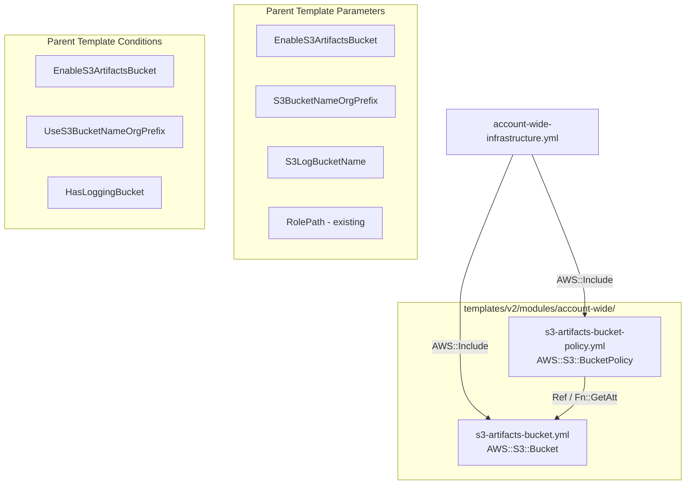

# Design Document

## Overview

This feature extracts the S3 artifacts bucket and bucket policy from the existing `template-storage-s3-artifacts.yml` into reusable account-wide modules, then integrates them into the `account-wide-infrastructure.yml` template with conditional creation support.

The key difference from the storage template is that the account-wide version:
- Removes per-project scoping (no `Prefix`/`ProjectId` in bucket name or policy)
- Grants access to ALL pipeline roles in the account regardless of prefix
- Uses the same conditional creation pattern as the API Gateway CloudWatch module (`EnableApiGwCloudWatchLogs` → `EnableApiGatewayLogging` condition)

Two new module files are created following the established module pattern (top-level `Type:`, `Condition:`, `Properties:` — no wrapping logical name). The parent template references them via `Fn::Transform: AWS::Include`.

## Architecture



### Design Decisions

1. **Separate bucket and policy modules**: Follows the same separation pattern as the API Gateway modules (`apigw-cloudwatch-role.yml` + `apigw-cloudwatch-account.yml`). This keeps each module focused on a single resource.

2. **Long-form intrinsic functions in modules**: `AWS::Include` does not support YAML shorthand tags (`!Ref`, `!Sub`, `!If`, etc.). All modules must use long-form syntax (`Ref:`, `Fn::Sub:`, `Fn::If:`, `Fn::GetAtt:`).

3. **No Prefix/ProjectId in bucket name**: The account-wide bucket is shared across all projects. The name pattern is `[S3BucketNameOrgPrefix-]cf-artifacts-${AccountId}-${Region}-an`.

4. **Unprefixed wildcard IAM principals**: The bucket policy grants access to `CodePipelineServiceRole-*`, `CodeBuildServiceRole-*`, and `CloudFormationSvcRole-*` without any prefix constraint, making it accessible to all pipeline roles in the account.

5. **Conditional creation via parameter**: Uses the same pattern as `EnableApiGwCloudWatchLogs` — a String parameter with "true"/"false" allowed values, mapped to a condition that gates resource creation.

6. **DeletionPolicy: Retain**: Unlike the storage template, the account-wide bucket uses Retain to preserve artifacts for rollback and audit purposes if the stack is accidentally deleted. Pipeline artifacts may still be needed for application rollbacks.

## Components and Interfaces

### Module: s3-artifacts-bucket.yml

**Location**: `templates/v2/modules/account-wide/s3-artifacts-bucket.yml`

**Resource Type**: `AWS::S3::Bucket`

**Parent Template Prerequisites**:
- Parameters: `S3BucketNameOrgPrefix`, `S3LogBucketName`
- Conditions: `UseS3BucketNameOrgPrefix`, `HasLoggingBucket`, `EnableS3ArtifactsBucket`

**Key Properties**:
| Property | Value |
|----------|-------|
| BucketName | `[S3BucketNameOrgPrefix-]cf-artifacts-${AccountId}-${Region}-an` |
| DeletionPolicy | Retain |
| Versioning | Enabled |
| PublicAccessBlock | All four blocks true |
| Encryption | AES256 |
| Lifecycle | Expire 395 days, noncurrent 30 days, abort multipart 1 day |
| Logging | Conditional on `HasLoggingBucket` |

### Module: s3-artifacts-bucket-policy.yml

**Location**: `templates/v2/modules/account-wide/s3-artifacts-bucket-policy.yml`

**Resource Type**: `AWS::S3::BucketPolicy`

**Parent Template Prerequisites**:
- Parameters: `RolePath`
- Conditions: `EnableS3ArtifactsBucket`
- Pseudo-parameters: `AWS::AccountId`
- Resource reference: `S3ArtifactsBucketRegional` (the bucket logical ID)

**Policy Statements**:
| Statement | Effect | Principal | Actions |
|-----------|--------|-----------|---------|
| DenyNonSecureTransportAccess | Deny | * | s3:* (when SecureTransport=false) |
| WhitelistedGet | Allow | CodePipeline/CodeBuild/CloudFormation roles | s3:GetObject, s3:GetObjectVersion, s3:GetBucketVersioning |
| WhitelistedPut | Allow | CodePipeline/CodeBuild roles | s3:PutObject |

### Parent Template Changes: account-wide-infrastructure.yml

**New Parameters**:
- `EnableS3ArtifactsBucket` (String, "true"/"false", default "false")
- `S3BucketNameOrgPrefix` (String, optional org prefix for bucket naming)
- `S3LogBucketName` (String, optional logging bucket)

**New Conditions**:
- `EnableS3ArtifactsBucket`: `Equals [EnableS3ArtifactsBucket, "true"]`
- `UseS3BucketNameOrgPrefix`: `Not [Equals [S3BucketNameOrgPrefix, ""]]`
- `HasLoggingBucket`: `Not [Equals [S3LogBucketName, ""]]`

**New Resources**:
- `S3ArtifactsBucketRegional` — via `AWS::Include` → `s3-artifacts-bucket.yml`
- `S3ArtifactBucketPolicy` — via `AWS::Include` → `s3-artifacts-bucket-policy.yml`

**New Outputs**:
- `S3ArtifactsBucketName` — bucket name (conditional, exported)
- `S3ArtifactsBucketConsole` — console link (conditional)

**New Metadata Parameter Group**:
- "S3 Artifacts Bucket" containing `EnableS3ArtifactsBucket`, `S3BucketNameOrgPrefix`, `S3LogBucketName`

## Data Models

This feature does not introduce application-level data models. The resources are CloudFormation infrastructure definitions:

### S3 Bucket Configuration

```yaml
BucketName: "[OrgPrefix-]cf-artifacts-{AccountId}-{Region}-an"
DeletionPolicy: Retain
Versioning: Enabled
Encryption: AES256
PublicAccess: Fully blocked
Lifecycle:
  ExpirationInDays: 395
  NoncurrentVersionExpirationInDays: 30
  AbortIncompleteMultipartUpload: 1 day
```

### Bucket Policy Principal Pattern

```
arn:aws:iam::{AccountId}:role{RolePath}CodePipelineServiceRole-*
arn:aws:iam::{AccountId}:role{RolePath}CodeBuildServiceRole-*
arn:aws:iam::{AccountId}:role{RolePath}CloudFormationSvcRole-*
```

### Export Naming

```
{OrgPrefix}-S3-Artifacts-Bucket-Name
```

## Correctness Properties

*Property-based testing is not applicable for this feature. This is Infrastructure as Code (CloudFormation templates) — declarative resource definitions rather than functions with variable inputs and outputs. The templates define static configurations validated by CloudFormation at deploy time, and the input space is constrained by AllowedValues/AllowedPattern. The following invariants are verified through cfn-lint and manual review instead.*

### Property 1: Module long-form syntax

*For any* module file included via `AWS::Include`, all intrinsic function references SHALL use long-form syntax (`Ref:`, `Fn::Sub:`, `Fn::If:`, `Fn::GetAtt:`) and SHALL NOT contain YAML shorthand tags (`!Ref`, `!Sub`, `!If`).

**Validates: Requirements 1.1, 1.2**

### Property 2: Module structure compliance

*For any* module file, the top-level structure SHALL begin with `Type:` and include a `Condition:` key referencing the parent template's gating condition.

**Validates: Requirements 1.1, 1.2**

### Property 3: Conditional resource safety

*For any* deployment where `EnableS3ArtifactsBucket` is "false", the stack SHALL create zero S3 bucket or bucket policy resources and SHALL NOT produce errors related to the disabled resources.

**Validates: Requirements 2.1, 2.2**

### Property 4: Bucket policy principal pattern

*For any* principal ARN in the bucket policy, the ARN SHALL follow the pattern `arn:aws:iam::{AccountId}:role{RolePath}{RoleName}-*` with unprefixed role wildcards granting access to all pipeline roles in the account.

**Validates: Requirements 3.1, 3.2**

### Property 5: Export naming convention

*For any* stack output that is exported, the export name SHALL follow the established pattern `{OrgPrefix}-S3-Artifacts-Bucket-Name` consistent with existing account-wide exports.

**Validates: Requirements 4.1**

## Error Handling

Since this is CloudFormation IaC, error handling is managed by CloudFormation's stack operations:

1. **Invalid parameter values**: Caught by `AllowedPattern` and `AllowedValues` constraints at deploy time
2. **Bucket name conflicts**: If the bucket name already exists (in another account or region), CloudFormation will fail the stack creation with a clear error
3. **Conditional creation**: When `EnableS3ArtifactsBucket` is "false", no S3 resources are created — no error paths
4. **Missing logging bucket**: When `S3LogBucketName` is empty, logging configuration is omitted via `Fn::If` with `AWS::NoValue`
5. **Module loading failures**: If the S3 module location is incorrect, `AWS::Include` will fail at transform time with a descriptive error

## Testing Strategy

Property-based testing is **not applicable** for this feature. This is Infrastructure as Code (CloudFormation templates) — declarative configuration rather than functions with inputs/outputs. The templates define static resource configurations that are validated by CloudFormation at deploy time.

### Recommended Testing Approach

1. **CloudFormation Linting** (`cfn-lint`):
   - Validate all three files (two modules + modified parent template) pass linting
   - The repository already has cfn-lint configured with ignore rules for `AWS::Include` patterns

2. **Template Validation**:
   - Run `aws cloudformation validate-template` against the parent template
   - Verify the template parses correctly with all new parameters and conditions

3. **Manual Integration Testing**:
   - Deploy the stack with `EnableS3ArtifactsBucket=true` and verify bucket creation
   - Deploy with `EnableS3ArtifactsBucket=false` and verify no bucket resources
   - Test with and without `S3BucketNameOrgPrefix` to verify both naming paths
   - Test with and without `S3LogBucketName` to verify conditional logging

4. **Module Syntax Verification**:
   - Verify modules use only long-form intrinsic functions (no YAML shorthand)
   - Verify modules start with `Type:` at top level
   - Verify `Condition:` is present in both modules

5. **Policy Verification**:
   - Confirm bucket policy grants access to unprefixed role wildcards
   - Confirm DenyNonSecureTransport statement is present
   - Verify principal ARN patterns match expected format
