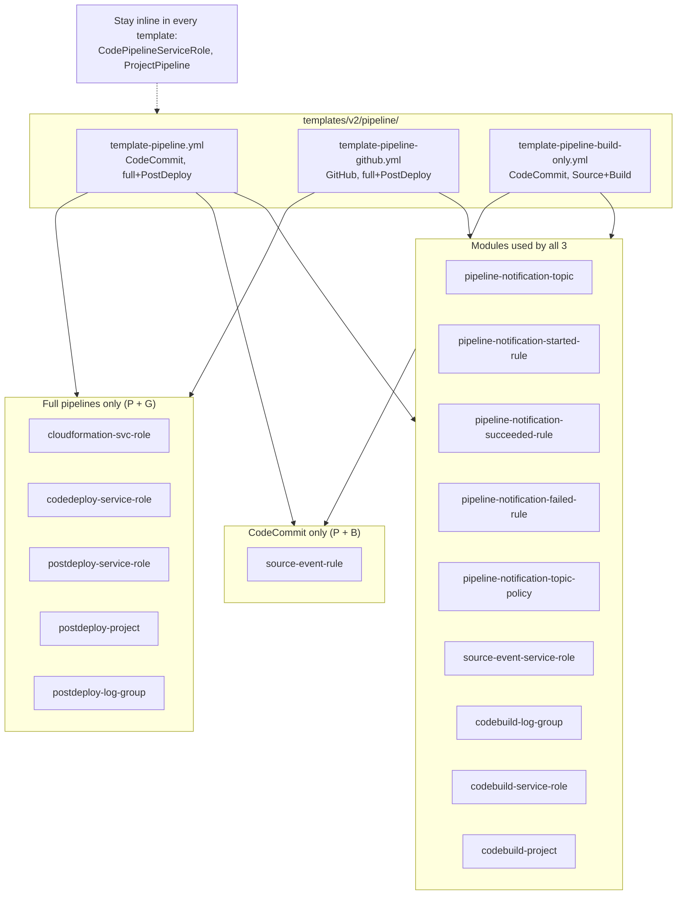

# Design Document

## Overview

This feature extracts the pieces that are duplicated across the three pipeline
templates into a new `templates/v2/modules/pipeline/` module set, then refactors
each pipeline template to consume those modules via `Fn::Transform: AWS::Include`.
It mirrors the pattern already used by the account templates
(`account-wide-infrastructure.yml`, `prefix-based-infrastructure.yml`).

Fifteen module files are created. Each is a headerless single-resource snippet
(top-level `Type:`, optional `Condition:`/`DeletionPolicy:`/`UpdateReplacePolicy:`,
then `Properties:`) using long-form intrinsics. Each parent template keeps the
parameters, conditions, and mappings its modules reference, adds the
`S3ModuleLocation`/`S3ModuleNamespace` parameters and a cfn-lint ignore set, and
replaces each extracted inline resource with an `AWS::Include` reference keyed at
the SAME logical ID (so no resource is replaced on update).

Two intentional standardizations are applied so that resources that differ today
can be shared: the CodeBuild container image is standardized to Amazon Linux 2023
across all three templates, and the reconciled `CodeBuildServiceRole` adds the
read-only `s3:GetBucketLocation` action. `CodePipelineServiceRole` genuinely
differs across all three and remains inline.

## Architecture



All modules resolve from
`s3://${S3ModuleLocation}/${S3ModuleNamespace}/templates/v2/modules/pipeline/<file>.yml`.

### How `AWS::Include` preserves logical IDs and conditions

Each extracted resource is referenced in the parent like this:

```yaml
  PipelineNotificationTopic:                 # logical ID preserved
    Fn::Transform:
      Name: AWS::Include
      Parameters:
        Location: !Sub "s3://${S3ModuleLocation}/${S3ModuleNamespace}/templates/v2/modules/pipeline/pipeline-notification-topic.yml"
```

The module file content is merged into the object that holds the `Fn::Transform`.
So a module that contains:

```yaml
Type: AWS::IAM::Role
Condition: IsNotDevelopment
Properties: { ... }
```

resolves to a resource with the same logical ID plus `Type`, `Condition`, and
`Properties`. Because the logical ID is unchanged and the resolved definition is
equivalent, CloudFormation performs an in-place update (no replacement). This is
the same mechanism the account-wide `s3-artifacts-bucket.yml` module uses to carry
`Condition: EnableS3ArtifactsBucket`.

`DependsOn` on an inline resource (e.g., `ProjectPipeline` → `CodeBuildProject`)
continues to work because the referenced logical ID still exists after the
transform. When a `DependsOn` is needed alongside a transform it is placed as a
sibling of `Fn::Transform` in the parent (as `account-wide-infrastructure.yml`
does for `ApiGatewayAccount`).

### Design Decisions

1. **One resource per module, logical name assigned by the parent.** Matches the
   maintainer's requirement and the existing module pattern. The notification
   block therefore becomes five modules, not one.

2. **Long-form intrinsics only.** `AWS::Include` does not support YAML shorthand
   tags. Every `!Sub`/`!Ref`/`!If`/`!GetAtt`/`!Join`/`!Select`/`!Split`/`!FindInMap`
   in the current inline resources is rewritten to `Fn::Sub:`/`Ref:`/`Fn::If:`/
   `Fn::GetAtt:`/`Fn::Join:`/`Fn::Select:`/`Fn::Split:`/`Fn::FindInMap:`. This is
   the bulk of the mechanical work, especially for the ~350-line
   `cloudformation-svc-role.yml`.

3. **Keep parameters/conditions/mappings in the parent.** `AWS::Include` injects
   only into the `Resources` section. Parameters, Conditions, and Mappings that
   modules reference (including `LambdaInsightsAccountId` and
   `LambdaParamSecretsAccountId`) stay defined in each consuming template.

4. **Preserve logical IDs = non-breaking update.** Converting an inline resource
   to an include at the same logical ID does not replace the resource, so the
   change is treated as a PATCH increment per the template-version-control
   steering.

5. **`S3ModuleLocation` is required (no default).** Consistent with the account
   templates. Existing update automation must supply it; provisioning that value
   and granting the deploying role `s3:GetObject` on the module bucket is handled
   by an external process (out of scope). This is the one caveat to the otherwise
   non-breaking classification and is documented in the CHANGELOG and template
   docs.

6. **Standardize the CodeBuild image (Intentional Behavior Change).** `CodeBuildProject`
   is identical across all three templates except the container image. Standardizing
   on `aws/codebuild/amazonlinux-x86_64-standard:5.0` (already used by
   `template-pipeline.yml` and by every `PostDeployProject`) lets a single
   `codebuild-project.yml` serve all three. github + build-only move from Amazon
   Linux 2 (Node 20) to Amazon Linux 2023 (Node 22).

7. **Reconcile `CodeBuildServiceRole` as a permission superset (Intentional
   Behavior Change).** The only functional delta was build-only carrying
   `s3:GetBucketLocation`. The reconciled module includes it so no template loses
   a permission; pipeline + github gain a harmless read-only action. The bucket
   ARN construction is normalized to the `Fn::Sub` + `OrgPrefix` form
   (functionally identical to build-only's `Fn::Join` form).

8. **Leave `CodePipelineServiceRole` and `ProjectPipeline` inline.** The pipeline
   service role differs across all three (CodeCommit read vs GitHub
   CodeConnections vs build-only's reduced set), and `ProjectPipeline` differs by
   source provider and stage set. Extraction would require per-template variants
   with little benefit, so both stay inline.

## Components and Interfaces

### Module catalog

| # | Module file (`templates/v2/modules/pipeline/`) | Resource Type | Resource `Condition` | Consumed by | Sibling logical IDs referenced |
|---|---|---|---|---|---|
| 1 | `pipeline-notification-topic.yml` | `AWS::SNS::Topic` | (none) | P, G, B | — |
| 2 | `pipeline-notification-started-rule.yml` | `AWS::Events::Rule` | (none) | P, G, B | `PipelineNotificationTopic` |
| 3 | `pipeline-notification-succeeded-rule.yml` | `AWS::Events::Rule` | (none) | P, G, B | `PipelineNotificationTopic` |
| 4 | `pipeline-notification-failed-rule.yml` | `AWS::Events::Rule` | (none) | P, G, B | `PipelineNotificationTopic` |
| 5 | `pipeline-notification-topic-policy.yml` | `AWS::SNS::TopicPolicy` | (none) | P, G, B | `PipelineNotificationTopic` |
| 6 | `source-event-service-role.yml` | `AWS::IAM::Role` | `IsNotDevelopment` | P, G, B | — |
| 7 | `source-event-rule.yml` | `AWS::Events::Rule` | `IsNotDevelopment` | P, B | `SourceEventServiceRole` |
| 8 | `codebuild-log-group.yml` | `AWS::Logs::LogGroup` | `IsNotDevelopment` | P, G, B | — |
| 9 | `codebuild-service-role.yml` | `AWS::IAM::Role` | `IsNotDevelopment` | P, G, B | — |
| 10 | `codebuild-project.yml` | `AWS::CodeBuild::Project` | `IsNotDevelopment` | P, G, B | `CodeBuildServiceRole` |
| 11 | `cloudformation-svc-role.yml` | `AWS::IAM::Role` | (none) | P, G | — |
| 12 | `codedeploy-service-role.yml` | `AWS::IAM::Role` | (none) | P, G | — |
| 13 | `postdeploy-service-role.yml` | `AWS::IAM::Role` | `IsPostDeployEnabledAndNotDev` | P, G | — |
| 14 | `postdeploy-project.yml` | `AWS::CodeBuild::Project` | `IsPostDeployEnabledAndNotDev` | P, G | `PostDeployServiceRole` |
| 15 | `postdeploy-log-group.yml` | `AWS::Logs::LogGroup` | `IsPostDeployEnabledAndNotDev` | P, G | — |

P = template-pipeline.yml, G = template-pipeline-github.yml, B = template-pipeline-build-only.yml

### Parent prerequisites by module

Each module's header comment documents the exact prerequisites. Summary:

| Module | Parameters | Conditions | Mappings |
|---|---|---|---|
| notification-topic | Prefix, ProjectId, StageId, AlarmNotificationEmail | — | — |
| notification-*-rule | Prefix, ProjectId, StageId | — | — |
| notification-topic-policy | — | — | — |
| source-event-service-role | Prefix, ProjectId, StageId, RolePath, PermissionsBoundaryArn | IsNotDevelopment, HasPermissionsBoundaryArn | — |
| source-event-rule | Prefix, ProjectId, StageId, Repository, RepositoryBranch | IsNotDevelopment | — |
| codebuild-log-group | Prefix, ProjectId, StageId | IsNotDevelopment | — |
| codebuild-service-role | Prefix, ProjectId, StageId, RolePath, PermissionsBoundaryArn, S3ArtifactsBucket, S3BucketNameOrgPrefix, S3StaticHostBucket, ParameterStoreHierarchy, DeployEnvironment, BuildSpec, CodeBuildSvcRoleIncludeManagedPolicyArns | IsNotDevelopment, HasPermissionsBoundaryArn, HasManagedPoliciesForCodeBuildSvcRole, UseS3BucketNameOrgPrefix, HasS3StaticHostBucket, HasS3BuildSpecLocation | — |
| codebuild-project | Prefix, ProjectId, StageId, S3ArtifactsBucket, S3BucketNameOrgPrefix, Repository, RepositoryBranch, ParameterStoreHierarchy, DeployEnvironment, AlarmNotificationEmail, S3StaticHostBucket, RolePath, PermissionsBoundaryArn, BuildSpec | IsNotDevelopment, UseS3BucketNameOrgPrefix, HasS3BuildSpecLocation, UseDefaultBuildSpecLocation | — |
| cloudformation-svc-role | Prefix, ProjectId, StageId, RolePath, PermissionsBoundaryArn, S3ArtifactsBucket, S3BucketNameOrgPrefix, ParameterStoreHierarchy, DeployEnvironment, CloudFormationSvcRoleIncludeManagedPolicyArns | HasPermissionsBoundaryArn, HasManagedPoliciesForCloudFormationSvcRole, UseS3BucketNameOrgPrefix | LambdaInsightsAccountId, LambdaParamSecretsAccountId |
| codedeploy-service-role | Prefix, ProjectId, StageId, RolePath, PermissionsBoundaryArn | HasPermissionsBoundaryArn | — |
| postdeploy-service-role | Prefix, ProjectId, StageId, RolePath, PermissionsBoundaryArn, S3ArtifactsBucket, S3BucketNameOrgPrefix, ParameterStoreHierarchy, DeployEnvironment, PostDeployS3StaticHostBucket, PostDeployBuildSpec, PostDeploySvcRoleIncludeManagedPolicyArns | IsPostDeployEnabledAndNotDev, HasPermissionsBoundaryArn, HasManagedPoliciesForPostDeploySvcRole, HasPostDeployS3StaticHostBucket, HasPostDeployBuildSpecS3Location, UseS3BucketNameOrgPrefix | — |
| postdeploy-project | Prefix, ProjectId, StageId, S3ArtifactsBucket, S3BucketNameOrgPrefix, Repository, RepositoryBranch, ParameterStoreHierarchy, DeployEnvironment, AlarmNotificationEmail, PostDeployS3StaticHostBucket, RolePath, PermissionsBoundaryArn, PostDeployBuildSpec | IsPostDeployEnabledAndNotDev, UseS3BucketNameOrgPrefix, HasPostDeployBuildSpecS3Location, UseDefaultPostDeployBuildSpecLocation | — |
| postdeploy-log-group | Prefix, ProjectId, StageId | IsPostDeployEnabledAndNotDev | — |

### Parent template changes

All three templates receive:

- **New parameters** `S3ModuleLocation` (String, required, S3-bucket-name pattern,
  no default) and `S3ModuleNamespace` (String, default `atlantis`), copied verbatim
  from the account templates.
- **New metadata**: a `cfn-lint` → `config` → `ignore_checks` block listing
  `E3001`, `E3005`, `E6101`, `W2001`, `W8001`, and a "Module Source" parameter
  group containing `S3ModuleLocation` and `S3ModuleNamespace`.
- **Version bump** as the first edit (P: v2.0.21, G: v2.0.4, B: v2.0.6, current date).
- **Resource replacement**: each extracted inline resource replaced by an
  `AWS::Include` reference at the same logical ID.

Per-template extraction set:

| Template | Modules consumed | Remains inline |
|---|---|---|
| template-pipeline.yml | 1-15 (all) | CodePipelineServiceRole, ProjectPipeline, Parameters, Mappings, Conditions, Outputs |
| template-pipeline-github.yml | 1-6, 8-15 (no source-event-rule) | CodePipelineServiceRole (with CodeConnectionsAccess + GitHubConnectionArn), ProjectPipeline, GitHubConnectionArn param, Parameters, Mappings, Conditions, Outputs |
| template-pipeline-build-only.yml | 1-10 (no CFN/CodeDeploy/PostDeploy) | CodePipelineServiceRole, ProjectPipeline, Parameters, Conditions, Outputs |

Note: `template-pipeline-github.yml` currently declares `SourceEventServiceRole`
even though it has no `SourceEvent` rule (it triggers via the CodeConnections
webhook). This is pre-existing; the extraction preserves it by consuming
`source-event-service-role.yml`. Removing the vestigial role is out of scope.

## Data Models

This feature is Infrastructure as Code; there are no application data models. The
relevant structures are the module snippet shape and the include reference shape.

### Module snippet shape

```yaml
# -- <Resource description> --
# Parent template must define parameters: <list>
# Parent template must define conditions: <list>
# Parent template must define mappings: <list>            # when applicable
# Parent must name the <referenced> resource '<LogicalId>' # when applicable
# NOTE: AWS::Include does not support YAML shorthand tags (!Sub, !Ref, etc.)
#       All intrinsic functions must use long-form syntax (Fn::Sub, Ref, etc.)

Type: <AWS::Service::Resource>
Condition: <ParentCondition>          # only if the inline resource had one
DeletionPolicy: <policy>              # only if the inline resource had one
UpdateReplacePolicy: <policy>         # only if the inline resource had one
Properties:
  ...long-form intrinsics...
```

### Include reference shape (parent)

```yaml
  <LogicalId>:
    Fn::Transform:
      Name: AWS::Include
      Parameters:
        Location: !Sub "s3://${S3ModuleLocation}/${S3ModuleNamespace}/templates/v2/modules/pipeline/<file>.yml"
```

## Correctness Properties

*Property-based testing is not applicable for this feature. This is Infrastructure
as Code (CloudFormation templates) — declarative resource definitions rather than
functions with variable inputs and outputs. The following invariants are verified
through cfn-lint and manual review instead, consistent with the testing guidance
for this repository.*

### Property 1: Module long-form syntax
*For any* module file created by this feature, all intrinsic function references
SHALL use long-form syntax and SHALL NOT contain YAML shorthand tags.
**Validates: Requirements 1.3**

### Property 2: Module structure compliance
*For any* module file, the top-level structure SHALL begin with `Type:` (no
wrapping logical name), and WHERE the inline resource had a `Condition`,
`DeletionPolicy`, or `UpdateReplacePolicy`, the module SHALL retain those keys.
**Validates: Requirements 1.2, 1.6, 1.7**

### Property 3: Logical-ID preservation
*For any* resource replaced by an include, the parent SHALL key the include at the
resource's original logical ID, so that the fully resolved template contains the
same logical IDs as before.
**Validates: Requirements 8.3, 8.10**

### Property 4: Cross-reference integrity
*For any* module that references a sibling by logical ID (`PipelineNotificationTopic`,
`SourceEventServiceRole`, `CodeBuildServiceRole`, `PostDeployServiceRole`), every
consuming template SHALL name that sibling resource with the exact logical ID.
**Validates: Requirements 2.6, 3.4, 5.5, 7.4**

### Property 5: Prerequisite completeness
*For any* consuming template, every parameter, condition, and mapping referenced by
the modules it consumes SHALL remain defined in that template.
**Validates: Requirements 8.9**

### Property 6: Behavior parity (except intentional changes)
*For any* modified template, the fully resolved template SHALL be functionally
equivalent to the pre-refactor template, except for the CodeBuild image upgrade
(github/build-only) and the `s3:GetBucketLocation` superset (pipeline/github).
**Validates: Requirements 8.10, Intentional Behavior Changes**

## Error Handling

Handled by CloudFormation stack operations and cfn-lint:

1. **Missing `S3ModuleLocation`**: the stack update fails fast with a parameter
   validation error; provisioning it is an external concern.
2. **Module not found / wrong namespace**: `AWS::Include` fails at transform time
   with a descriptive S3 access/location error.
3. **Missing prerequisite (parameter/condition/mapping)**: cfn-lint and the
   transform surface undefined-reference errors; the module headers list the
   required prerequisites to prevent this.
4. **Shorthand tag in a module**: the transform fails; caught by cfn-lint and the
   module-syntax checkpoint.
5. **Conditional resources**: when `IsNotDevelopment` / `IsPostDeployEnabledAndNotDev`
   is false, the resolved resource carries the condition and is simply not created,
   exactly as today.

## Testing Strategy

Property-based testing is **not applicable** (declarative IaC). The approach:

1. **cfn-lint** on all three modified templates using the repository's configured
   ignore rules (plus the newly added `E3001`/`E3005`/`E6101`/`W2001`/`W8001`),
   verifying they parse with the new parameters, metadata, and includes.
2. **Module syntax verification**: each module begins with `Type:`, contains no
   YAML shorthand tags, retains the correct `Condition`/`DeletionPolicy`/
   `UpdateReplacePolicy`, and its header lists the correct prerequisites.
3. **Behavior-parity review**: diff each extracted module against the original
   inline resource to confirm equivalence (allowing only the long-form rewrite,
   the removed wrapping logical name, and the two Intentional Behavior Changes).
4. **Cross-reference check**: confirm each consuming template still defines every
   referenced parameter/condition/mapping and names every referenced sibling
   logical ID.
5. **Optional deploy validation**: `aws cloudformation validate-template` and a
   test deploy with `S3ModuleLocation` pointing at a bucket holding the modules,
   covering `DeployEnvironment=DEV` (conditioned resources absent) and
   `PostDeployStageEnabled` true/false.

Fast unit-style checks (steps 1-4) are the primary mechanism; deploy validation
(step 5) is recommended before release.
