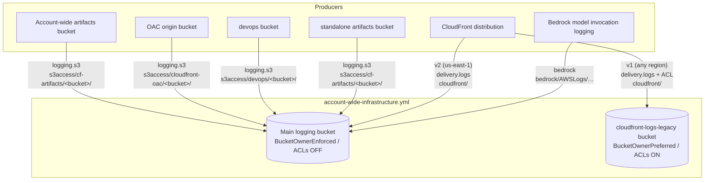

# Design — v0.0.44 Bedrock Media Logging + Log Prefix Segmentation & Service Lockdown

## 1. Overview

This design implements the 14 requirements in `requirements.md`. The central change is an account-wide **two-bucket logging model** plus a consistent **provider-prefix taxonomy**, **per-prefix lifecycle**, and **per-principal, per-prefix bucket policies**. Bedrock large-object (media) payloads are routed to S3; CloudFront gains a v1/v2 choice; producer buckets auto-target the account-wide logging bucket.

All intrinsic-function snippets destined for module files (`templates/v2/modules/**`) use long-form intrinsics (`Fn::Sub`, `Ref`, `Fn::If`, `Fn::GetAtt`) per `template-module-standards.md`. Parent-template snippets may use shorthand.

### 1.1 Architecture



### 1.2 Destination-selection precedence (shared pattern)

Every producer and the Bedrock media path use the same three-tier precedence, expressed as nested `Fn::If`:

```
1. explicit override param (S3LogBucketName / BedrockLargeObjectLogBucketName) if non-empty
2. else imported account-wide bucket (via Fn::ImportValue) if available
3. else AWS::NoValue (no logging)
```

The import uses the **uppercase** `OrgPrefix` (e.g. `ACME`), matching the export names produced by `account-wide-infrastructure.yml` — not the lowercase `S3BucketNameOrgPrefix` used for bucket naming. Producer templates that lack an `OrgPrefix` parameter gain an optional one (precedent: `prefix-based-infrastructure.yml` added optional `OrgPrefix` in v0.0.39 to import `${OrgPrefix}-S3-Artifacts-Bucket-Name`).

---

## 2. `account-wide-infrastructure.yml`

### 2.1 New / changed parameters

| Parameter | Type | Default | Group | Notes |
|---|---|---|---|---|
| `S3AccessLogExpirationInDays` | Number (1–365) | 180 | S3 Access Log Bucket | Drives the four `s3access/*` lifecycle rules |
| `EnableBedrockLargeObjectLogging` | String true/false | `"false"` | S3 Bedrock Large Object Logs (new group) | Master toggle for media→S3 |
| `BedrockLargeObjectLogExpirationInDays` | Number (1–365) | 90 | S3 Bedrock Large Object Logs | S3 lifecycle for `bedrock/`; distinct from CW `BedrockInvocationLogExpirationInDays` |
| `BedrockLargeObjectLogBucketName` | String (S3 name or `""`) | `""` | S3 Bedrock Large Object Logs | Alternate external destination; precedence over account-wide bucket |
| `AllowLegacyCloudFrontLogs` | String true/false | `"false"` | S3 Access Log Bucket | **Repurposed:** now provisions the separate legacy bucket |
| `LogExpirationInDays` | Number (1–365) | 180 | S3 Access Log Bucket | Unchanged; now drives `cloudfront/` (main) + legacy bucket lifecycle |

`S3LogBucketName` (existing, artifacts override) is unchanged.

### 2.2 Conditions

```yaml
EnableS3AccessLogBucket:        !Equals [!Ref EnableS3AccessLogBucket, "true"]     # existing
EnableLegacyCloudFrontLogs:     !Equals [!Ref AllowLegacyCloudFrontLogs, "true"]   # existing name, new effect
UseS3BucketNameOrgPrefix:       !Not [!Equals [!Ref S3BucketNameOrgPrefix, ""]]    # existing
EnableBedrockLargeObjectLogging: !Equals [!Ref EnableBedrockLargeObjectLogging, "true"]
HasBedrockLargeObjectLogBucket:  !Not [!Equals [!Ref BedrockLargeObjectLogBucketName, ""]]
# Bedrock media targets the account-wide main bucket (not an external bucket):
BedrockMediaToAccountBucket:    !And
  - !Condition EnableBedrockLargeObjectLogging
  - !Not [!Condition HasBedrockLargeObjectLogBucket]
  - !Condition EnableS3AccessLogBucket
```

`BedrockMediaToAccountBucket` gates both the Bedrock statement on the main bucket policy (R1.5) and the `bedrock/` lifecycle rule on the main bucket (R3.2 / R5.4).

### 2.3 Rules section (R11)

```yaml
Rules:
  BedrockMediaRequiresDestination:
    RuleCondition: !Equals [!Ref EnableBedrockLargeObjectLogging, "true"]
    Assertions:
      - Assert: !Or
          - !Equals [!Ref EnableS3AccessLogBucket, "true"]
          - !Not [!Equals [!Ref BedrockLargeObjectLogBucketName, ""]]
        AssertDescription: "When EnableBedrockLargeObjectLogging is 'true', either EnableS3AccessLogBucket must be 'true' or BedrockLargeObjectLogBucketName must be provided."
```

### 2.4 Resources wired via AWS::Include

- `AccessLogBucketRegional` → `modules/s3-access-logs/s3-access-log-bucket.yml` (modified §3.1)
- `AccessLogBucketPolicy` → `modules/s3-access-logs/s3-access-log-bucket-policy.yml` (modified §3.2)
- **New** `CloudFrontLegacyLogBucket` → `modules/s3-access-logs/cloudfront-legacy-log-bucket.yml` (§4.1)
- **New** `CloudFrontLegacyLogBucketPolicy` → `modules/s3-access-logs/cloudfront-legacy-log-bucket-policy.yml` (§4.2)

### 2.5 Outputs (additions)

```yaml
CloudFrontLegacyLogBucketName:
  Condition: EnableLegacyCloudFrontLogs
  Value: !Ref CloudFrontLegacyLogBucket
  Export: { Name: !Sub "${OrgPrefix}-CloudFront-Legacy-Log-Bucket-Name" }
CloudFrontLegacyLogBucketArn:
  Condition: EnableLegacyCloudFrontLogs
  Value: !GetAtt CloudFrontLegacyLogBucket.Arn
  Export: { Name: !Sub "${OrgPrefix}-CloudFront-Legacy-Log-Bucket-Arn" }
```

Existing `${OrgPrefix}-S3-AccessLog-Bucket-Name` / `-Arn` exports are retained unchanged.

### 2.6 Bedrock activation output (R2)

The `BedrockModelInvocationLoggingEnableCommand` value becomes conditional on `EnableBedrockLargeObjectLogging`:

```yaml
Value: !If
  - EnableBedrockLargeObjectLogging
  - !Sub
    - '{"cloudWatchConfig":{"logGroupName":"${BedrockModelInvocationLogGroup}","roleArn":"${BedrockCloudWatchLogsRole.Arn}","largeDataDeliveryS3Config":{"bucketName":"${MediaBucket}","keyPrefix":"bedrock"}},"textDataDeliveryEnabled":true,"embeddingDataDeliveryEnabled":true,"imageDataDeliveryEnabled":true,"videoDataDeliveryEnabled":true}'
    - MediaBucket: !If [HasBedrockLargeObjectLogBucket, !Ref BedrockLargeObjectLogBucketName, !Ref AccessLogBucketRegional]
  # else: byte-for-byte the v0.0.43 payload (image/video false, no largeDataDeliveryS3Config)
  - !Sub '{"cloudWatchConfig":{"logGroupName":"${BedrockModelInvocationLogGroup}","roleArn":"${BedrockCloudWatchLogsRole.Arn}"},"textDataDeliveryEnabled":true,"embeddingDataDeliveryEnabled":true,"imageDataDeliveryEnabled":false,"videoDataDeliveryEnabled":false}'
```

Note the resolved key prefix is `bedrock`; Bedrock appends `/AWSLogs/${AccountId}/BedrockModelInvocationLogs/`, so objects land under `bedrock/AWSLogs/...`.

---

## 3. Main logging bucket modules

### 3.1 `s3-access-log-bucket.yml` (bucket)

Changes:
- **Ownership:** replace the `EnableLegacyCloudFrontLogs` conditional `OwnershipControls`/`BlockPublicAcls` with **unconditional** `BucketOwnerEnforced` and `BlockPublicAcls: true` (R7).
- **Lifecycle:** replace the single `DeleteOldLogs` rule with prefix-filtered rules (R5). `bedrock/` rule present only under `BedrockMediaToAccountBucket`.

```yaml
Type: AWS::S3::Bucket
Condition: EnableS3AccessLogBucket
DeletionPolicy: Retain
UpdateReplacePolicy: Retain
Properties:
  BucketName:
    Fn::If:
      - UseS3BucketNameOrgPrefix
      - Fn::Sub: "${S3BucketNameOrgPrefix}-access-logs-${AWS::AccountId}-${AWS::Region}-an"
      - Fn::Sub: "access-logs-${AWS::AccountId}-${AWS::Region}-an"
  BucketNamespace: "account-regional"
  VersioningConfiguration: { Status: Suspended }
  BucketEncryption:
    ServerSideEncryptionConfiguration:
      - BucketKeyEnabled: true
        ServerSideEncryptionByDefault: { SSEAlgorithm: AES256 }
  PublicAccessBlockConfiguration:
    BlockPublicAcls: true
    BlockPublicPolicy: true
    IgnorePublicAcls: true
    RestrictPublicBuckets: true
  OwnershipControls:
    Rules:
      - ObjectOwnership: BucketOwnerEnforced
  LifecycleConfiguration:
    Rules:
      - Id: ExpireCloudFront
        Status: Enabled
        Filter: { Prefix: "cloudfront/" }
        ExpirationInDays: { Ref: LogExpirationInDays }
      - Id: ExpireS3AccessCfArtifacts
        Status: Enabled
        Filter: { Prefix: "s3access/cf-artifacts/" }
        ExpirationInDays: { Ref: S3AccessLogExpirationInDays }
      - Id: ExpireS3AccessCloudFrontOac
        Status: Enabled
        Filter: { Prefix: "s3access/cloudfront-oac/" }
        ExpirationInDays: { Ref: S3AccessLogExpirationInDays }
      - Id: ExpireS3AccessDevops
        Status: Enabled
        Filter: { Prefix: "s3access/devops/" }
        ExpirationInDays: { Ref: S3AccessLogExpirationInDays }
      - Id: ExpireS3AccessApps
        Status: Enabled
        Filter: { Prefix: "s3access/apps/" }
        ExpirationInDays: { Ref: S3AccessLogExpirationInDays }
      - Fn::If:
          - BedrockMediaToAccountBucket
          - Id: ExpireBedrockMedia
            Status: Enabled
            Filter: { Prefix: "bedrock/" }
            ExpirationInDays: { Ref: BedrockLargeObjectLogExpirationInDays }
          - Ref: AWS::NoValue
```

> Module contract comment must be updated to declare the new params (`S3AccessLogExpirationInDays`, `BedrockLargeObjectLogExpirationInDays`) and conditions (`BedrockMediaToAccountBucket`), and to drop `AllowLegacyCloudFrontLogs`/`EnableLegacyCloudFrontLogs` from this module's contract.

### 3.2 `s3-access-log-bucket-policy.yml` (main bucket policy)

Statements (R6): keep `DenyNonSecureTransportAccess`; scope `logging.s3` to `s3access/*`; add v2 CloudFront and Bedrock statements conditionally. Remove the legacy `delivery.logs` statement (it moves to the legacy bucket policy §4.2).

```yaml
Type: AWS::S3::BucketPolicy
Condition: EnableS3AccessLogBucket
Properties:
  Bucket: { Ref: AccessLogBucketRegional }
  PolicyDocument:
    Version: "2012-10-17"
    Statement:
      - Sid: DenyNonSecureTransportAccess
        Effect: Deny
        Principal: "*"
        Action: "s3:*"
        Resource:
          - Fn::GetAtt: [AccessLogBucketRegional, Arn]
          - Fn::Join: ["/", [Fn::GetAtt: [AccessLogBucketRegional, Arn], "*"]]
        Condition: { Bool: { "aws:SecureTransport": false } }

      - Sid: AllowS3AccessLogDelivery
        Effect: Allow
        Principal: { Service: logging.s3.amazonaws.com }
        Action: "s3:PutObject"
        Resource:
          Fn::Sub: "${AccessLogBucketRegional.Arn}/s3access/*"
        Condition:
          StringEquals: { "aws:SourceAccount": { Ref: "AWS::AccountId" } }
          ArnLike: { "aws:SourceArn": "arn:aws:s3:::*-an" }   # naming-convention lockdown (R6.3)

      - Fn::If:
          - BedrockMediaToAccountBucket
          - Sid: AllowBedrockLargeObjectDelivery
            Effect: Allow
            Principal: { Service: bedrock.amazonaws.com }
            Action: "s3:PutObject"
            Resource:
              Fn::Sub: "${AccessLogBucketRegional.Arn}/bedrock/AWSLogs/${AWS::AccountId}/BedrockModelInvocationLogs/*"
            Condition:
              StringEquals: { "aws:SourceAccount": { Ref: "AWS::AccountId" } }
              ArnLike: { "aws:SourceArn": { Fn::Sub: "arn:${AWS::Partition}:bedrock:${AWS::Region}:${AWS::AccountId}:*" } }
          - Ref: AWS::NoValue
```

> **CloudFront v2 statement placement (design decision):** the v2 `delivery.logs.amazonaws.com` grant on the main bucket must exist for delivery to succeed, but the *account-wide* stack does not know whether any distribution will use v2. Two options: (a) always include the v2 statement on the main bucket (scoped to `cloudfront/*`), gated on `EnableS3AccessLogBucket`; or (b) add a `EnableCloudFrontV2Logs` toggle to the account-wide template. **Recommendation: option (a)** — an unused `Allow PutObject` to `delivery.logs.amazonaws.com` scoped to `cloudfront/*` with `aws:SourceAccount` + `aws:SourceArn arn:...:delivery-source:*` is harmless when no distribution is configured, and avoids a cross-stack ordering/coupling toggle. Confirm during review (see §11 open item O1).

The v2 statement (option a):

```yaml
      - Sid: AllowCloudFrontV2LogDelivery
        Effect: Allow
        Principal: { Service: delivery.logs.amazonaws.com }
        Action: "s3:PutObject"
        Resource:
          Fn::Sub: "${AccessLogBucketRegional.Arn}/cloudfront/*"
        Condition:
          StringEquals:
            "s3:x-amz-acl": "bucket-owner-full-control"
            "aws:SourceAccount": { Ref: "AWS::AccountId" }
          ArnLike:
            "aws:SourceArn": { Fn::Sub: "arn:${AWS::Partition}:logs:us-east-1:${AWS::AccountId}:delivery-source:*" }
```

(`bucket-owner-full-control` is accepted by a `BucketOwnerEnforced` bucket, so this coexists with ACLs disabled.)

---

## 4. New legacy CloudFront bucket modules

### 4.1 `cloudfront-legacy-log-bucket.yml`

```yaml
# -- CloudFront Legacy (v1) Standard-Logging Bucket (Account-Wide) --
# Parent must define params: S3BucketNameOrgPrefix, LogExpirationInDays
# Parent must define conditions: UseS3BucketNameOrgPrefix, EnableLegacyCloudFrontLogs
Type: AWS::S3::Bucket
Condition: EnableLegacyCloudFrontLogs
DeletionPolicy: Retain
UpdateReplacePolicy: Retain
Properties:
  BucketName:
    Fn::If:
      - UseS3BucketNameOrgPrefix
      - Fn::Sub: "${S3BucketNameOrgPrefix}-cloudfront-logs-legacy-${AWS::AccountId}-${AWS::Region}-an"
      - Fn::Sub: "cloudfront-logs-legacy-${AWS::AccountId}-${AWS::Region}-an"
  BucketNamespace: "account-regional"
  VersioningConfiguration: { Status: Suspended }
  BucketEncryption:
    ServerSideEncryptionConfiguration:
      - BucketKeyEnabled: true
        ServerSideEncryptionByDefault: { SSEAlgorithm: AES256 }
  PublicAccessBlockConfiguration:
    BlockPublicAcls: false          # ACLs enabled for legacy CloudFront delivery
    BlockPublicPolicy: true
    IgnorePublicAcls: true
    RestrictPublicBuckets: true
  OwnershipControls:
    Rules:
      - ObjectOwnership: BucketOwnerPreferred
  LifecycleConfiguration:
    Rules:
      - Id: ExpireCloudFrontLegacy
        Status: Enabled
        Filter: { Prefix: "cloudfront/" }
        ExpirationInDays: { Ref: LogExpirationInDays }
```

### 4.2 `cloudfront-legacy-log-bucket-policy.yml`

```yaml
# Parent must name the bucket resource 'CloudFrontLegacyLogBucket'
Type: AWS::S3::BucketPolicy
Condition: EnableLegacyCloudFrontLogs
Properties:
  Bucket: { Ref: CloudFrontLegacyLogBucket }
  PolicyDocument:
    Version: "2012-10-17"
    Statement:
      - Sid: DenyNonSecureTransportAccess
        Effect: Deny
        Principal: "*"
        Action: "s3:*"
        Resource:
          - Fn::GetAtt: [CloudFrontLegacyLogBucket, Arn]
          - Fn::Join: ["/", [Fn::GetAtt: [CloudFrontLegacyLogBucket, Arn], "*"]]
        Condition: { Bool: { "aws:SecureTransport": false } }
      - Sid: AllowCloudFrontLegacyLogDelivery
        Effect: Allow
        Principal: { Service: delivery.logs.amazonaws.com }
        Action: "s3:PutObject"
        Resource:
          Fn::Sub: "${CloudFrontLegacyLogBucket.Arn}/cloudfront/*"
        Condition:
          StringEquals: { "s3:x-amz-acl": "bucket-owner-full-control" }
```

> The legacy bucket is gated on `EnableLegacyCloudFrontLogs` **independent** of `EnableS3AccessLogBucket`, so an admin may enable legacy CloudFront logging without the main access-log bucket. Both `AWS::Include` files carry `Condition: EnableLegacyCloudFrontLogs`.

---

## 5. Producer template retrofits (R9)

Common changes per producer: add optional `OrgPrefix` (uppercase) parameter + `HasOrgPrefix` condition; replace the `LoggingConfiguration` with the three-tier precedence and the new `s3access/<type>/<bucket-name>/` prefix.

Destination resolution pattern (shorthand, standalone templates):

```yaml
Conditions:
  HasLoggingBucket: !Not [!Equals [!Ref S3LogBucketName, ""]]
  HasOrgPrefix:     !Not [!Equals [!Ref OrgPrefix, ""]]
  UseAccountLogBucket: !And [!Not [!Condition HasLoggingBucket], !Condition HasOrgPrefix]
# ...
LoggingConfiguration: !If
  - HasLoggingBucket
  - DestinationBucketName: !Ref S3LogBucketName
    LogFilePrefix: !Sub "s3access/<type>/${ThisBucketName}/"
  - !If
    - UseAccountLogBucket
    - DestinationBucketName: !ImportValue
        Fn::Sub: "${OrgPrefix}-S3-AccessLog-Bucket-Name"
      LogFilePrefix: !Sub "s3access/<type>/${ThisBucketName}/"
    - !Ref AWS::NoValue
```

Where `${ThisBucketName}` is the producer bucket's own computed name and `<type>` is the fixed literal per template:

| Template | `<type>` | Notes |
|---|---|---|
| `modules/account-wide/s3-artifacts-bucket.yml` | `cf-artifacts` | long-form intrinsics; already has `AccessLogBucketRegional` sibling + `S3LogBucketName`; add `s3access/cf-artifacts/` prefix. Uses `Ref AccessLogBucketRegional` directly (same stack) rather than ImportValue. |
| `storage/template-storage-s3-oac-for-cloudfront.yml` | `cloudfront-oac` | add `OrgPrefix` + import fallback; replace computed-slug prefix |
| `storage/template-storage-s3-devops.yml` | `devops` | add `OrgPrefix` + import fallback |
| `storage/template-storage-s3-artifacts.yml` | `cf-artifacts` | add `OrgPrefix` + import fallback |

The account-wide artifacts **module** differs: it is in the same stack as `AccessLogBucketRegional`, so its fallback uses `Ref: AccessLogBucketRegional` (existing behavior) rather than `Fn::ImportValue`. Its precedence stays `S3LogBucketName` → `AccessLogBucketRegional` (when `EnableS3AccessLogBucket`) → none, only the prefix changes to `s3access/cf-artifacts/<bucket-name>/`.

> `<bucket-name>` is retained even for singletons (R4.4). For the account-wide artifacts bucket the value is the bucket's own name (`Fn::Sub` of the same expression used for `BucketName`).

Cache-data bucket: no change (R9.7).

---

## 6. Network template CloudFront v1/v2 (R10)

### 6.1 Parameter + conditions

```yaml
Parameters:
  CloudFrontLoggingVersion:
    Type: String
    AllowedValues: [none, v1, v2]
    Default: v1
    Description: >-
      CloudFront access logging mode. 'v1' = legacy standard logging (works in
      any region; delivers to an ACL-enabled bucket such as the account-wide
      cloudfront-logs-legacy bucket). 'v2' = standard logging v2 (requires this
      stack be deployed in us-east-1 and an ACL-disabled bucket such as the
      account-wide main logging bucket in us-east-1). 'none' disables logging.
  OrgPrefix:            # uppercase org prefix for account-wide imports; add if not present
    Type: String
    Default: ""
Conditions:
  IsUsEast1:    !Equals [!Ref "AWS::Region", "us-east-1"]
  HasLogBucket: !Not [!Equals [!Ref S3LogBucketName, ""]]
  HasOrgPrefix: !Not [!Equals [!Ref OrgPrefix, ""]]
  CfLogV1: !Equals [!Ref CloudFrontLoggingVersion, "v1"]
  CfLogV2: !And [!Equals [!Ref CloudFrontLoggingVersion, "v2"], !Condition IsUsEast1]
```

### 6.2 v1 (inline Logging block) — retained under `CfLogV1`

```yaml
Logging: !If
  - CfLogV1
  - IncludeCookies: 'false'
    Bucket: !Sub
      - "${LegacyBucket}.s3.amazonaws.com"
      - LegacyBucket: !If
          - HasLogBucket
          - !Ref S3LogBucketName
          - !If [HasOrgPrefix, !ImportValue { "Fn::Sub": "${OrgPrefix}-CloudFront-Legacy-Log-Bucket-Name" }, !Ref "AWS::NoValue"]
    Prefix: "cloudfront/"
  - !Ref AWS::NoValue
```

(If neither an override nor an import is available, `Logging` resolves to `AWS::NoValue` = no logging. `Prefix` becomes just `cloudfront/`; the distribution/stage identity is already captured in log fields and the legacy bucket is per-account.)

### 6.3 v2 (CloudWatch Logs delivery resources) — created only under `CfLogV2`

```yaml
CloudFrontDeliverySource:
  Type: AWS::Logs::DeliverySource
  Condition: CfLogV2
  Properties:
    Name: !Sub "${Prefix}-${ProjectId}-${StageId}-cf-access-logs"
    ResourceArn: !Sub "arn:${AWS::Partition}:cloudfront::${AWS::AccountId}:distribution/${CloudFrontDistribution}"
    LogType: ACCESS_LOGS

CloudFrontDeliveryDestination:
  Type: AWS::Logs::DeliveryDestination
  Condition: CfLogV2
  Properties:
    Name: !Sub "${Prefix}-${ProjectId}-${StageId}-cf-s3-dest"
    DestinationResourceArn: !Sub
      - "arn:${AWS::Partition}:s3:::${DestBucket}/cloudfront"
      - DestBucket: !If
          - HasLogBucket
          - !Ref S3LogBucketName
          - !If [HasOrgPrefix, !ImportValue { "Fn::Sub": "${OrgPrefix}-S3-AccessLog-Bucket-Name" }, !Ref "AWS::NoValue"]

CloudFrontDelivery:
  Type: AWS::Logs::Delivery
  Condition: CfLogV2
  Properties:
    DeliverySourceName: !Ref CloudFrontDeliverySource
    DeliveryDestinationArn: !GetAtt CloudFrontDeliveryDestination.Arn
```

The `/cloudfront` suffix on `DestinationResourceArn` produces object keys under `cloudfront/AWSLogs/${AccountId}/CloudFront/...`, which the main bucket's `cloudfront/` lifecycle rule and the `AllowCloudFrontV2LogDelivery` policy statement (§3.2) already cover.

> **Region behavior:** when `CloudFrontLoggingVersion=v2` but the stack is not us-east-1, `CfLogV2` is false, so none of the three delivery resources are created (R10.4). The parameter description states the requirement; we do not add a hard fail.

### 6.4 Outputs

Add a `CloudFrontLoggingMode` output echoing the effective mode (`v1`/`v2`/`none`, and note "v2 requested but not us-east-1 → disabled" where applicable via `Fn::If`), to aid operators.

---

## 7. Lifecycle summary (normative)

| Bucket | Rule Id | Filter.Prefix | Expiration param |
|---|---|---|---|
| Main | ExpireCloudFront | `cloudfront/` | `LogExpirationInDays` |
| Main | ExpireS3AccessCfArtifacts | `s3access/cf-artifacts/` | `S3AccessLogExpirationInDays` |
| Main | ExpireS3AccessCloudFrontOac | `s3access/cloudfront-oac/` | `S3AccessLogExpirationInDays` |
| Main | ExpireS3AccessDevops | `s3access/devops/` | `S3AccessLogExpirationInDays` |
| Main | ExpireS3AccessApps | `s3access/apps/` | `S3AccessLogExpirationInDays` |
| Main | ExpireBedrockMedia (conditional) | `bedrock/` | `BedrockLargeObjectLogExpirationInDays` |
| Legacy | ExpireCloudFrontLegacy | `cloudfront/` | `LogExpirationInDays` |

---

## 8. Migration / cutover notes

This is a coordinated, breaking change set (accepted per §5 Q5). Order of operations for an existing deployment:

1. **Deploy `account-wide-infrastructure.yml` first.** The main bucket policy tightens `logging.s3` to `s3access/*`. Until producers are updated (step 2), producers still logging to old prefixes (root/`cf-artifacts/`) will have deliveries **denied**. This is expected and transient.
2. **Update each producer stack** (artifacts already same-stack; OAC, devops, standalone artifacts, network) so their `LogFilePrefix` matches the new `s3access/<type>/<bucket-name>/` scheme.
3. **CloudFront:** choose `v1` (default; works in the deploying region against the legacy bucket) or `v2` (us-east-1 only). If moving an existing distribution from v1→v2, expect a brief gap while the delivery resources propagate.
4. **Bedrock media:** set `EnableBedrockLargeObjectLogging=true`, deploy, then run the updated `BedrockModelInvocationLoggingEnableCommand` once per region.
5. Old log objects under previous prefixes remain until their pre-existing lifecycle expires; no data is moved.

Buckets use `DeletionPolicy: Retain` / `UpdateReplacePolicy: Retain`; none of these changes replace a bucket (naming unchanged for the main bucket; the legacy bucket is additive).

---

## 9. Testing & validation

Per `testing-guidelines.md` (fast unit tests first, minimal property tests):
1. `cfn-lint` all modified templates; keep existing `AWS::Include` suppressions (E6101/W2001/W8001) on the account-wide parent.
2. Render/validate the account-wide template with combinations: bedrock media on/off, alternate bucket set/empty, legacy on/off, org-prefix set/empty — assert the `Rules` assertion fires when bedrock on + no destination.
3. Assert the activation-output JSON is byte-identical to v0.0.43 when `EnableBedrockLargeObjectLogging=false`.
4. Network template: render v1 (non-us-east-1) and v2 (us-east-1 vs other) and assert delivery resources exist only under `CfLogV2`.
5. Validate producer prefixes resolve to `s3access/<type>/<bucket-name>/`.

---

## 10. Documentation & steering updates (R13, R14)

- `docs/admin-ops/bedrock-model-invocation-logging.md`: new "S3 large-object / media delivery" section (bucket policy, `bedrock/` prefix, SSE-KMS caveat, updated activation JSON, external-bucket caveat).
- Template READMEs for account-wide, s3-oac-for-cloudfront, s3-devops, s3-artifacts, network route53-cloudfront + affected category READMEs.
- `.kiro/steering/s3-access-logs-module-sync.md`: add D1–D7 as intentional account-wide-only supersets; restrict sync obligation to shared primitives (Option A).

---

## 11. Open design items — RESOLVED

- **O1 (§3.2) — RESOLVED (yes).** Always include the `AllowCloudFrontV2LogDelivery` statement on the main bucket (scoped to `cloudfront/*`); no `EnableCloudFrontV2Logs` toggle.
- **O2 (§6.2) — RESOLVED (keep simple).** CloudFront v1 uses the flat `cloudfront/` prefix; distributions share it in the legacy bucket. Per-distribution lifecycle, if ever needed, is handled by a separately provisioned bucket, not here.
- **O3 — RESOLVED (holds).** The `logging.s3` `aws:SourceArn` `ArnLike arn:aws:s3:::*-an` pattern matches all in-scope producer buckets (all use the regional `-an` suffix).

---

## 12. Requirements traceability

| Requirement | Design section |
|---|---|
| R1 Bedrock media to S3 | §2.1, §2.2, §3.2 (Bedrock stmt) |
| R2 Activation output | §2.6 |
| R3 Media retention | §2.1, §3.1 (bedrock rule) |
| R4 Prefix taxonomy | §1.1, §5, §7 |
| R5 Per-prefix lifecycle | §3.1, §7 |
| R6 Main policy lockdown | §3.2 |
| R7 Main bucket ACLs off | §3.1 |
| R8 Legacy bucket | §4.1, §4.2, §2.5 |
| R9 Producer retrofits | §5 |
| R10 CloudFront v1/v2 | §6 |
| R11 Rules validation | §2.3 |
| R12 Versioning in place | §8, tasks |
| R13 Sync steering | §10 |
| R14 Documentation | §10 |
