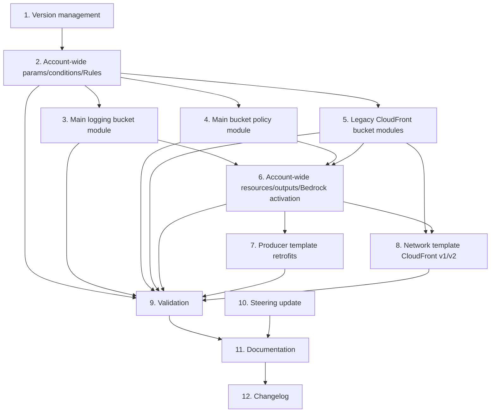

# Implementation Plan

Tasks — v0.0.44 Bedrock Media Logging + Log Prefix Segmentation & Service Lockdown

## Overview

Implementation task list for `design.md`. Breaking changes are applied **in place** (no new versioned files) per Requirement 12 / PLAN §5 Q5 (approved override of `template-version-control.md`). Version bumps below follow: breaking → MINOR in place; non-breaking → PATCH.

Legend: each task notes the requirement(s) it satisfies. Tasks are ordered so modules exist before the parent references them, and so validation follows each change.

## Tasks

### 1. Version management (in-place bumps)

- [ ] 1.1 Bump `account-wide-infrastructure.yml` header `Version:` v2.0.2 → **v2.1.0** + today's date (breaking: policy scope tightening, `AllowLegacyCloudFrontLogs` repurposed) _(R12)_
- [ ] 1.2 Bump `templates/v2/storage/template-storage-s3-oac-for-cloudfront.yml` v0.1.2 → **v0.2.0** + date (breaking: log prefix + destination change) _(R12)_
- [ ] 1.3 Bump `templates/v2/storage/template-storage-s3-devops.yml` v0.0.2 → **v0.1.0** + date (breaking: log prefix + destination change) _(R12)_
- [ ] 1.4 Bump `templates/v2/storage/template-storage-s3-artifacts.yml` v0.0.2 → **v0.1.0** + date (breaking: log prefix + destination change) _(R12)_
- [ ] 1.5 Bump `templates/v2/network/template-network-route53-cloudfront-s3-apigw.yml` v0.0.18 → **v0.1.0** + date (breaking: CloudFront logging restructure) _(R12)_
- [ ] 1.6 `templates/v2/storage/template-storage-s3-access-logs.yml` remains **frozen** (Option A). Only bump PATCH v0.0.3 → v0.0.4 + date IF a comment/deprecation note is added; otherwise leave unchanged _(R12.3)_

### 2. Account-wide parameters, conditions, and Rules

- [ ] 2.1 Add parameters to `account-wide-infrastructure.yml`: `S3AccessLogExpirationInDays` (Number 1–365, default 180), `EnableBedrockLargeObjectLogging` (true/false, default false), `BedrockLargeObjectLogExpirationInDays` (Number 1–365, default 90), `BedrockLargeObjectLogBucketName` (S3-name-or-empty, default "") _(R1.1, R3.1, R5.5, R11.3)_
- [ ] 2.2 Add a new "S3 Bedrock Large Object Logs" parameter group to the `AWS::CloudFormation::Interface` metadata; add `S3AccessLogExpirationInDays` to the existing "S3 Access Log Bucket" group _(R1.1, R5.5)_
- [ ] 2.3 Update `LogExpirationInDays` and `AllowLegacyCloudFrontLogs` parameter descriptions to reflect their new roles (shared default incl. `cloudfront/` + legacy bucket lifecycle; legacy param now provisions a separate bucket) _(R5.2, R8.1)_
- [ ] 2.4 Add conditions `EnableBedrockLargeObjectLogging`, `HasBedrockLargeObjectLogBucket`, and `BedrockMediaToAccountBucket` (`And` of the first two negated + `EnableS3AccessLogBucket`) _(R1.2, R3.2)_
- [ ] 2.5 Add the `Rules` section asserting Bedrock media requires an access-log bucket or an alternate destination _(R11.1, R11.2)_

### 3. Main logging bucket module (`modules/s3-access-logs/s3-access-log-bucket.yml`)

- [ ] 3.1 Replace the conditional ownership/`BlockPublicAcls` with unconditional `BucketOwnerEnforced` + `BlockPublicAcls: true` (drop `EnableLegacyCloudFrontLogs` branches from this module) _(R7.1, R7.2, R7.3)_
- [ ] 3.2 Replace the single `DeleteOldLogs` rule with the five prefix-filtered rules (`cloudfront/`→`LogExpirationInDays`; four `s3access/*`→`S3AccessLogExpirationInDays`) plus the conditional `ExpireBedrockMedia` rule (`bedrock/`→`BedrockLargeObjectLogExpirationInDays`, gated on `BedrockMediaToAccountBucket`) _(R5.1–R5.4, R3.2)_
- [ ] 3.3 Update the module contract comment block: add new params/conditions, remove `AllowLegacyCloudFrontLogs`/`EnableLegacyCloudFrontLogs`; keep encryption/versioning/Retain unchanged _(R7.4, template-module-standards)_

### 4. Main bucket policy module (`modules/s3-access-logs/s3-access-log-bucket-policy.yml`)

- [ ] 4.1 Keep `DenyNonSecureTransportAccess`; rename/rescope the S3 access-log grant to `AllowS3AccessLogDelivery` on `${bucket.Arn}/s3access/*` with `aws:SourceAccount` + `ArnLike aws:SourceArn arn:aws:s3:::*-an` _(R6.1, R6.2, R6.3)_
- [ ] 4.2 Add the always-present `AllowCloudFrontV2LogDelivery` statement (`delivery.logs.amazonaws.com`, `${bucket.Arn}/cloudfront/*`, conditions `s3:x-amz-acl=bucket-owner-full-control` + `aws:SourceAccount` + `aws:SourceArn arn:...:logs:us-east-1:...:delivery-source:*`) — per O1 _(R6.4)_
- [ ] 4.3 Add the conditional `AllowBedrockLargeObjectDelivery` statement (`bedrock.amazonaws.com`, `${bucket.Arn}/bedrock/AWSLogs/${AccountId}/BedrockModelInvocationLogs/*`, `aws:SourceAccount` + `aws:SourceArn arn:...:bedrock:...:*`), gated on `BedrockMediaToAccountBucket` _(R1.2, R1.3, R1.5)_
- [ ] 4.4 Remove the legacy `AllowCloudFrontLogDelivery` statement from this module (moves to §5); confirm no whole-bucket `/*` PutObject grant remains _(R6.5, R8.8)_
- [ ] 4.5 Update the module contract comment block accordingly _(template-module-standards)_

### 5. New legacy CloudFront bucket modules

- [ ] 5.1 Create `modules/s3-access-logs/cloudfront-legacy-log-bucket.yml` (ACL-enabled: `BucketOwnerPreferred` + `BlockPublicAcls: false`; AES256; Suspended; Retain/Retain; single `cloudfront/` lifecycle on `LogExpirationInDays`; `Condition: EnableLegacyCloudFrontLogs`) with a full contract comment block _(R8.2, R8.3, R8.4, R8.5)_
- [ ] 5.2 Create `modules/s3-access-logs/cloudfront-legacy-log-bucket-policy.yml` (`DenyNonSecureTransportAccess` + `AllowCloudFrontLegacyLogDelivery` for `delivery.logs.amazonaws.com` on `${bucket.Arn}/cloudfront/*` with `s3:x-amz-acl=bucket-owner-full-control`; `Condition: EnableLegacyCloudFrontLogs`; references bucket resource `CloudFrontLegacyLogBucket`) _(R8.6)_

### 6. Account-wide resources, outputs, and Bedrock activation

- [ ] 6.1 Add `AWS::Include` resources `CloudFrontLegacyLogBucket` and `CloudFrontLegacyLogBucketPolicy` referencing the two new modules _(R8.2)_
- [ ] 6.2 Add conditional outputs `CloudFrontLegacyLogBucketName`/`-Arn` with exports `${OrgPrefix}-CloudFront-Legacy-Log-Bucket-Name`/`-Arn` _(R8.7)_
- [ ] 6.3 Make `BedrockModelInvocationLoggingEnableCommand` conditional: media-on branch includes `largeDataDeliveryS3Config` (resolved bucket + `keyPrefix: bedrock`) and sets image/video `true`; media-off branch is byte-identical to v0.0.43 _(R2.1, R2.2, R2.3, R2.4)_
- [ ] 6.4 Verify the account-wide artifacts **module** (`modules/account-wide/s3-artifacts-bucket.yml`) `LogFilePrefix` becomes `s3access/cf-artifacts/<bucket-name>/` (same-stack `Ref AccessLogBucketRegional` fallback retained) _(R4.3, R9.3)_

### 7. Producer template retrofits

- [ ] 7.1 `template-storage-s3-oac-for-cloudfront.yml`: add optional uppercase `OrgPrefix` param + `HasOrgPrefix`/`UseAccountLogBucket` conditions; set `LogFilePrefix: s3access/cloudfront-oac/<bucket-name>/`; implement `S3LogBucketName` → `Fn::ImportValue ${OrgPrefix}-S3-AccessLog-Bucket-Name` → none precedence _(R9.1, R9.2, R9.4)_
- [ ] 7.2 `template-storage-s3-devops.yml`: same pattern; `LogFilePrefix: s3access/devops/<bucket-name>/` _(R9.1, R9.2, R9.5)_
- [ ] 7.3 `template-storage-s3-artifacts.yml`: same pattern; `LogFilePrefix: s3access/cf-artifacts/<bucket-name>/` _(R9.1, R9.2, R9.6)_
- [ ] 7.4 Confirm cache-data bucket templates are untouched (no server access logging) _(R9.7)_

### 8. Network template CloudFront v1/v2

- [ ] 8.1 Add `CloudFrontLoggingVersion` param (`none|v1|v2`, default `v1`) with the v1/v2 requirements documented in its description; add optional uppercase `OrgPrefix` param; add to metadata groups _(R10.1, R10.6)_
- [ ] 8.2 Add conditions `IsUsEast1`, `HasOrgPrefix`, `CfLogV1`, `CfLogV2` (`v2 AND IsUsEast1`) _(R10.3, R10.4)_
- [ ] 8.3 Gate the inline `DistributionConfig.Logging` block on `CfLogV1`; set `Prefix: "cloudfront/"` (flat, per O2); destination precedence `S3LogBucketName` → import `${OrgPrefix}-CloudFront-Legacy-Log-Bucket-Name` → none _(R10.2, R10.5, R10.7)_
- [ ] 8.4 Add the three `AWS::Logs::` v2 delivery resources (`DeliverySource`/`DeliveryDestination`/`Delivery`) gated on `CfLogV2`; `DestinationResourceArn` = `arn:...:s3:::<dest>/cloudfront`; destination precedence `S3LogBucketName` → import `${OrgPrefix}-S3-AccessLog-Bucket-Name` → none _(R10.3, R10.4)_
- [ ] 8.5 Add a `CloudFrontLoggingMode` output reflecting the effective mode (incl. "v2 requested but not us-east-1 → disabled") _(R10.6)_

### 9. Validation

- [ ] 9.1 Run `cfn-lint` on all modified templates; confirm existing `AWS::Include` suppressions still apply and no new errors _(design §9)_
- [ ] 9.2 Unit-render the account-wide template across the matrix (bedrock on/off × alternate bucket set/empty × legacy on/off × org-prefix set/empty); assert the `Rules` assertion fires on bedrock-on-with-no-destination _(R11, design §9)_
- [ ] 9.3 Assert the media-off activation JSON is byte-identical to the v0.0.43 output _(R2.3)_
- [ ] 9.4 Render the network template for v1 (non-us-east-1), v2 (us-east-1), and v2 (other region) and assert delivery resources exist only under `CfLogV2` _(R10.4)_
- [ ] 9.5 Assert each producer resolves `LogFilePrefix` to `s3access/<type>/<bucket-name>/` and destination precedence is correct _(R4, R9)_

### 10. Steering update (Option A)

- [ ] 10.1 Update `.kiro/steering/s3-access-logs-module-sync.md`: note the account-wide side is a two-bucket superset; add D1–D7 to the intentional-differences list; restrict the sync obligation to shared primitives (encryption, versioning, retention policy type, secure-transport deny, ACL-toggle shape) _(R13.1, R13.2, R13.3)_

### 11. Documentation (required final task)

- [ ] 11.1 Update `docs/admin-ops/bedrock-model-invocation-logging.md` with the S3 large-object/media delivery section (bucket policy on `bedrock.amazonaws.com`, `bedrock/` prefix + fixed `AWSLogs/.../BedrockModelInvocationLogs/` layout, SSE-KMS caveat, updated activation JSON with image/video enabled, external-bucket manual-policy caveat) _(R14.1, R14.4)_
- [ ] 11.2 Update `docs/templates/v2/account/account-wide-infrastructure-README.md`: new params, two-bucket model, per-prefix lifecycle, new exports, Rules validation _(R14.2, R14.3)_
- [ ] 11.3 Update storage READMEs (s3-oac-for-cloudfront, s3-devops, s3-artifacts) and network README for new params/prefixes/logging behavior + CloudFront v1/v2 and us-east-1 requirement; update category READMEs where applicable _(R14.2, R14.3)_
- [ ] 11.4 Verify all documented parameters, resources, and outputs match the final templates _(R14.2)_

### 12. Changelog

- [ ] 12.1 Add entries under `## v0.0.44 (unreleased)` in `CHANGELOG.md`: an "Added" bullet for Bedrock large-object/media logging and the two-bucket + prefix-segmentation feature (with sub-bullets listing each template + new version), a "Changed"/"Breaking Changes" note for the policy tightening, `AllowLegacyCloudFrontLogs` repurposing, and prefix changes, referencing this spec _(R12.4, changelog steering)_

## Task Dependency Graph

Tasks are ordered so that shared modules exist before the parent templates reference them, and so validation, documentation, and changelog updates follow the implementation they describe.

Key ordering constraints:

- **Section 2 → 3/4/5**: parameters and conditions must exist before the modules and policy statements that reference them.
- **Sections 3/4/5 → 6**: the account-wide template's `AWS::Include` resources, outputs, and Bedrock activation depend on the module files existing.
- **Section 6 → 7**: producer templates import the account-wide log-bucket exports produced in §6.
- **Sections 5/6 → 8**: the network template imports both the legacy CloudFront bucket export (§5/§6) and the main access-log bucket export (§6).
- **Section 9** validates all implementation sections (2–8) and must run after them.
- **Sections 10/11 → 12**: steering and documentation updates precede the changelog entry that references the completed feature.

## Notes

Notes and assumptions carried from design:

- Module files use long-form intrinsics only; parent (account-wide, network, storage) templates may use shorthand.
- The legacy CloudFront bucket is gated on `EnableLegacyCloudFrontLogs` independent of `EnableS3AccessLogBucket`.
- CloudFront v2 delivery resources are created only when the network stack is deployed in us-east-1 (`CfLogV2`); no cross-region wiring.
- Producer imports use the uppercase `OrgPrefix` export names; producers without an explicit override and without `OrgPrefix` set will have no server access logging (safe default).
- No bucket is replaced by these changes (main bucket name unchanged; legacy bucket is additive; all Retain/UpdateReplace Retain).
