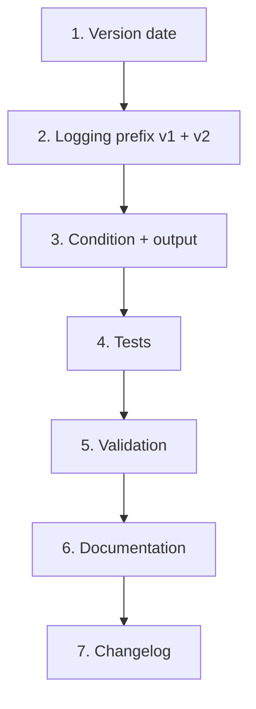

# Implementation Plan

Tasks — v0.0.44 CloudFront Log Prefix Identity Segmentation

## Overview

Implementation task list for `design.md`. All template changes are confined to `templates/v2/network/template-network-route53-cloudfront-s3-apigw.yml`; no account-wide or module templates are touched (verified in design §1.1).

## Tasks

### 1. Version management

- [x] 1.1 `template-network-route53-cloudfront-s3-apigw.yml` is at v0.1.0 (PATCH = 0, development mode, unreleased) — do **not** increment the version; update the header date to the change date only _(R6.1)_

### 2. Network template — logging prefix

- [x] 2.1 Change the v1 inline `DistributionConfig.Logging.Prefix` from `"cloudfront/"` to `!Sub "cloudfront/${Prefix}-${ProjectId}-${StageId}/"`, leaving `HasV1Destination`, bucket resolution, and the `AWS::NoValue` fallback unchanged _(R1.1, R1.2, R1.3, R1.4)_
- [x] 2.2 Change `CloudFrontDeliveryDestination.DestinationResourceArn` to append the destination prefix `cloudfront/${Prefix}-${ProjectId}-${StageId}` (no trailing slash), keeping the `DestBucket` precedence mapping and `CreateV2Delivery` gating unchanged _(R2.1, R2.2, R2.3, R2.4)_
- [x] 2.3 Correct the comment block above `CloudFrontDeliverySource`: the destination prefix sets the leading path of delivered objects and replaces the default `AWSLogs/<account>/<service>/` path, yielding keys under `cloudfront/<Prefix>-<ProjectId>-<StageId>/` _(R3.1)_

### 3. Network template — condition and output

- [x] 3.1 Add condition `HasCloudFrontLogging: !Or [!Condition HasV1Destination, !Condition CreateV2Delivery]`, placed with the other CloudFront logging conditions after `CreateV2Delivery` _(R4.2)_
- [x] 3.2 Update the `CloudFrontLogPrefix` output: condition `HasCloudFrontLogging`, value `!Sub "cloudfront/${Prefix}-${ProjectId}-${StageId}/"`, description noting it applies to both v1 and v2. Leave `CloudFrontLogBucket` unchanged _(R4.1, R4.2, R4.3)_

### 4. Tests

- [x] 4.1 `tests/test_network_template_unit.py` — `test_logging_prefix_format`: remove the `isinstance(prefix_value, dict)` guard (which made the test pass vacuously once the prefix became a plain string) and assert the exact new `!Sub` value _(R5.1)_
- [x] 4.2 `tests/test_network_template_unit.py` — update `test_cloudfront_log_prefix_has_condition` to `HasCloudFrontLogging`, update `test_cloudfront_log_prefix_value` to the trailing-slash value without a type guard, and split `test_cloudfront_log_bucket_and_prefix_consistency` so the bucket output keeps `HasLogBucket` while the prefix output expects `HasCloudFrontLogging` _(R5.3)_
- [x] 4.3 `tests/test_network_template_unit.py` — add `test_v2_delivery_destination_includes_identity_prefix` asserting the `DestinationResourceArn` `!Sub` template contains `/cloudfront/${Prefix}-${ProjectId}-${StageId}` and has no trailing slash _(R5.2)_
- [x] 4.4 `tests/test_network_template_unit.py` — add `test_has_cloudfront_logging_condition_exists` asserting the condition is an `!Or` over `HasV1Destination` and `CreateV2Delivery` _(R5.3)_
- [x] 4.5 `tests/test_network_template_property.py` — update the expected v1 prefix and docstring in the existing property test; add no new property-based tests _(R5.4)_

### 5. Validation

- [x] 5.1 Run `cfn-lint` on the network template; confirm no new findings _(design §8)_
- [x] 5.2 Run the full `pytest tests/` suite green _(R5.5)_
- [x] 5.3 Confirm no file under `templates/v2/account/` or `templates/v2/modules/` required modification _(design §1.1)_

### 6. Documentation (required final task)

- [x] 6.1 Update `docs/templates/v2/network/template-network-route53-cloudfront-s3-apigw-README.md` "v0.0.44 Changes (CloudFront logging v1/v2)" section: replace the flat-`cloudfront/` statement (v1 bullet) and the incorrect `cloudfront/AWSLogs/<account>/CloudFront/...` claim (v2 bullet) with the shared `cloudfront/<Prefix>-<ProjectId>-<StageId>/` layout _(R3.2, R3.3)_
- [x] 6.2 Update the `CloudFrontLogPrefix` output section (example value, condition, usage prose) and any parameter prose referencing the flat prefix _(R3.3, R4)_
- [x] 6.3 Update the examples that name a log path (Example 6, and Example 7 or any other affected example) _(R3.3)_
- [x] 6.4 Verify all documented parameters, resources, outputs, and conditions match the final template, and confirm every pre-existing blockquote (including the region-strategy note) is preserved _(R3, documentation steering)_

### 7. Changelog

- [x] 7.1 Add an entry under the existing `## v0.0.44 (unreleased)` section referencing this spec: CloudFront log objects (v1 and v2) now land under `cloudfront/<Prefix>-<ProjectId>-<StageId>/` instead of a flat `cloudfront/`; `CloudFrontLogPrefix` output condition widened to `HasCloudFrontLogging`; corrected v2 object-key documentation. Note that pre-existing objects under the flat prefix stay put and that updating a v2 stack replaces the delivery destination/delivery resources. Do not modify existing entries _(R6.2)_

## Task Dependency Graph

```json
{
  "waves": [
    { "id": 0, "tasks": ["1.1"] },
    { "id": 1, "tasks": ["2.1", "2.2", "2.3"] },
    { "id": 2, "tasks": ["3.1", "3.2"] },
    { "id": 3, "tasks": ["4.1", "4.2", "4.3", "4.4", "4.5"] },
    { "id": 4, "tasks": ["5.1", "5.2", "5.3"] },
    { "id": 5, "tasks": ["6.1", "6.2", "6.3", "6.4"] },
    { "id": 6, "tasks": ["7.1"] }
  ]
}
```



Key ordering constraints:

- **2 → 3**: the output and condition describe the prefix set in §2.
- **3 → 4**: tests assert the final condition name and output value.
- **4 → 5**: validation runs the updated suite.
- **5 → 6 → 7**: documentation reflects validated behavior; the changelog entry closes out the spec.

## Notes

- The identity segment goes **after** `cloudfront/`, which is what keeps the account-wide lifecycle rules and bucket-policy resource scopes matching without modification.
- v1 and v2 differ on the trailing slash by design: CloudFront's legacy `Prefix` is a filename prefix (slash makes it a folder), while the v2 destination prefix is a path appended to the bucket ARN.
- `s3access/<type>/<bucket-name>/` and `bedrock/` prefixes are explicitly out of scope and must not change.
